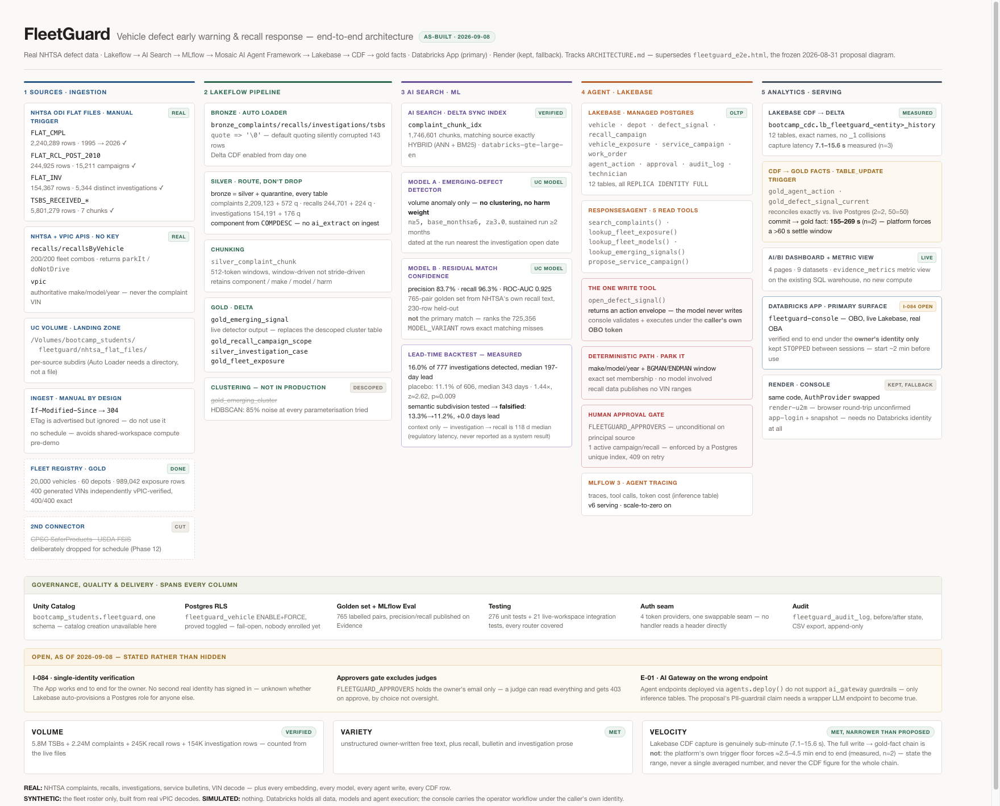

# FleetGuard

Vehicle defect early-warning and recall-response platform for commercial fleets, built on
Databricks (Lakeflow, Lakebase, Unity Catalog, Model Serving, AI Search) against NHTSA's
public defect corpus.

A fleet operator running thousands of vehicles today learns about safety defects the same
way a private owner does — when a recall posts. FleetGuard gives them two capabilities
instead of one:

- **Reactive — recall response.** A campaign posts; FleetGuard resolves its scope against
  the fleet's VIN roster, ranks exposure by depot and severity, and issues work orders under
  human approval — from recall to dispatched work order in seconds, not the days a manual
  cross-reference takes.
- **Proactive — early warning.** Detect a complaint pattern before NHTSA opens a formal
  investigation into it. **Measured, not projected: when it fires, a median 197-day lead on
  the investigation opening — but it only fires on 16.0% of investigations, against 11.1% on
  a volume-matched placebo control (1.44× lift, z ≈ 2.62, p ≈ 0.009).** A narrow, real edge on
  a minority of cases, not a general early-warning net. The system predicts that an
  investigation will open — not that a recall will be issued, and not which VINs are
  affected; see `docs/ARCHITECTURE.md` §1 for the precise, deliberately narrow claim.



*As-built, tracks `docs/ARCHITECTURE.md`. See also the [identity & authorisation diagram](docs/fleetguard_identity_current.png) and the [frozen 2026-08-31 proposal diagrams](docs/FleetGuard_Proposal.md) for what changed and why.*

## Live demo

**Primary — Databricks App:** [`fleetguard-console`](https://fleetguard-console-1352785079224954.aws.databricksapps.com)
— real per-user OBO: every query runs as *your* Databricks identity, not a service account
and not a simulation, so Unity Catalog and Postgres apply their own rules to you rather than
the app deciding what you may see.

**It is kept stopped between sessions** so it isn't billing idle compute, and it will not
answer a cold URL. **Start it yourself — about two minutes:**

```bash
databricks apps start fleetguard-console
```

You'll then see an **OAuth consent screen** listing `postgres`, `sql` and `model-serving`.
Accept it; declining returns `403 Invalid scope` on every data page, which looks like a broken
app rather than an unauthorised one. Please **stop it again** when you're done.

**The Assistant panel may say "the assistant is offline."** That is expected, not a fault: the
agent runs on a serving endpoint kept on scale-to-zero, and a stopped endpoint does not wake on
request. Every other tab is unaffected. Ask and it can be restored in about three minutes.

**[`docs/DEMO.md`](docs/DEMO.md) is the guided tour** — pre-flight with measured timings, the
nine beats worth seeing, every number with its source, and an explicit list of what this project
does *not* claim.

**Honest status of this path:** verified end to end, but under the owner's identity, and for the
API routes under a programmatic token rather than a browser. No second person has signed in yet.
The failure that would matter — authenticating successfully and then having every data route fail
for want of a Lakebase role — **cannot happen to the reviewers**, who were checked and all hold
one. It is unproven rather than known-broken (`docs/STATUS.md`, I-084).

**Fallback — Render:** https://fleetguard-console-abhi.onrender.com — kept live, not the
plan of record. Runs against live Lakebase via `render-u2m` (Databricks OAuth; the browser
login round-trip is itself unconfirmed) or against a committed snapshot via GitHub sign-in.
The **Evidence** tab needs no sign-in on either surface — it's the published backtest result
above, sourced live from the same measurement.

## What it's built on

- **Ingestion → medallion pipeline** (Lakeflow Declarative Pipelines): NHTSA's complaint,
  recall, investigation, and TSB flat files → bronze → silver → gold, with a quarantine
  split so `bronze = silver + quarantine` reconciles exactly at every layer.
- **Semantic retrieval**: Databricks AI Search over 1.7M+ complaint narrative chunks,
  hybrid (BM25 + embedding) search.
- **A registered, deployed agent** (Mosaic AI Agent Framework, Model Serving): six tools —
  five read (complaint search, fleet exposure, fleet vocabulary lookup, emerging-signal
  lookup, campaign proposal) and one real write (`open_defect_signal`, executed by the app
  under the caller's own identity, never by the model) — traced with MLflow, evaluated
  against a held-out golden set built from NHTSA's own recall text.
- **Lakebase Postgres** as the operational store for fleet state (vehicles, depots, service
  campaigns, work orders, audit log). Change Data Feed replicates every write into Unity
  Catalog — **measured 7.1–15.6 s for the capture itself**; the derived gold facts follow a
  `table_update` job, taking **2.5–4.5 minutes end to end** (two live cycles). The two numbers
  are kept apart deliberately: quoting the capture latency for the whole chain would overstate
  it by an order of magnitude. Postgres Row-Level Security enforces depot-scoped reads below
  the application, not just in it — proved live, with two honest limits: no principal is
  enrolled by default, so it is fail-open until someone is, and a reviewer holding
  `bypassrls` will not see it apply to their own session (`docs/DEMO.md` §5).
- **A FastAPI + React console**, one service for API and UI, running unchanged across
  Render and Databricks Apps behind a single auth seam (`app/backend/fleetguard_api/auth/`).

## Run it locally

```bash
scripts/run_local_static_dev.sh          # starts the backend at :8811 against live Lakebase
```

**The token it mints lives one hour.** After that every Lakebase-backed route returns 500 with
`Invalid Token` — which looks exactly like a code regression if you've been editing all
afternoon, and has been mistaken for one twice. The fix is to restart the script, not to debug
your changes; `static-dev` holds a *static* token by design.

See `app/backend/README.md` for what this sets up and why every one of its environment
variables is there. Frontend development lives in `app/frontend/` (`npm run dev`); rebuild
the console the backend serves with `scripts/build_console.sh`.

## Repository layout

| Path | What's there |
|---|---|
| `src/` | Ingestion, medallion pipelines, fleet registry, search, agent, backtest, Lakebase migrations |
| `app/` | The FastAPI backend + React console that make up the live product |
| `docs/` | Living architecture spec, build status, issue log, and the frozen original proposal |
| `scripts/` | Runnable setup/build scripts — local dev server, console build, evidence/snapshot export, demo-state seeding |
| `tests/` | Unit tests (run everywhere) and integration tests (opt-in, hit the live workspace) |
| `dashboards/` | AI/BI dashboard definitions |

## Documentation map

Read `docs/STATUS.md` first if you're picking this up cold — it's the one page answering
"where are we," with next steps in priority order.

| Document | Job |
|---|---|
| [`docs/DEMO.md`](docs/DEMO.md) | **Start here to look around** — pre-flight, the nine beats, numbers with sources, what not to claim |
| [`docs/ARCHITECTURE.md`](docs/ARCHITECTURE.md) | The living spec — what the system *is*, kept true with the code |
| [`docs/STATUS.md`](docs/STATUS.md) | Where the build has got to, updated every session |
| [`docs/ISSUES.md`](docs/ISSUES.md) | Every problem hit during the build, root cause, resolution — append-only |
| [`docs/ENHANCEMENTS.md`](docs/ENHANCEMENTS.md) | Evaluated backlog: adopted, deferred, or rejected, with reasons |
| [`docs/FleetGuard_Proposal.md`](docs/FleetGuard_Proposal.md) | What was proposed, before the build — **frozen**, not updated as facts changed |
| [`PLAN.md`](PLAN.md) | Phase sequencing and definitions of done |
