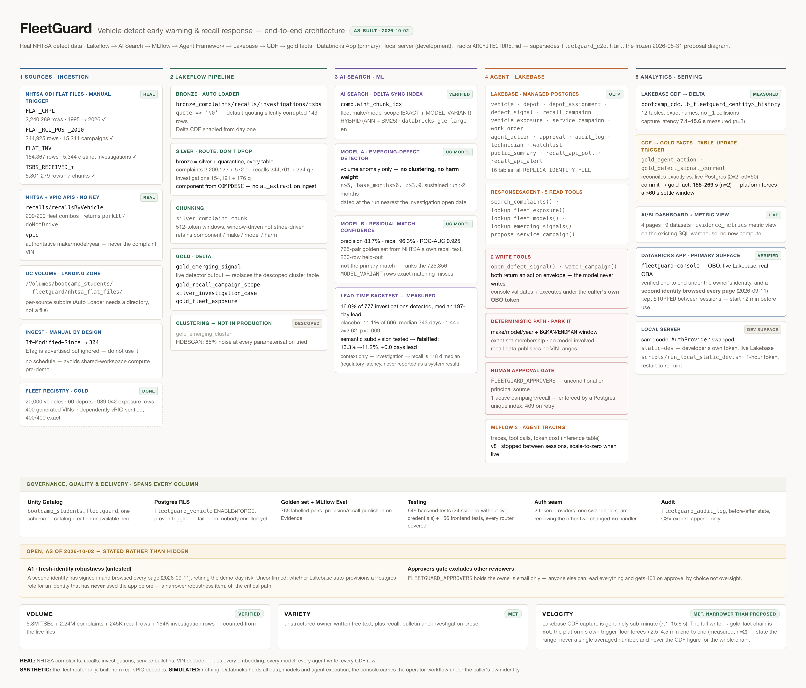

# FleetGuard

Vehicle defect early-warning and recall-response platform for commercial fleets, built on
Databricks (Lakeflow, Lakebase, Unity Catalog, Model Serving, AI Search) against NHTSA's
public defect corpus.

**Built for a fleet safety team** running thousands of vehicles — the people who resolve a
recall against the roster and decide what gets dispatched — and for the safety leadership
above them who need to know the program is actually working, not just busy. Today, a fleet
learns about safety defects the same way a private owner does — when a recall posts.
FleetGuard gives the team two capabilities instead of one:

- **Reactive — recall response.** A campaign posts; FleetGuard resolves its scope against
  the fleet's VIN roster, ranks exposure by depot and severity, and issues work orders under
  human approval — from recall to dispatched work order in seconds, not the days a manual
  cross-reference takes.
- **Proactive — early warning.** Detect a complaint pattern before NHTSA opens a formal
  investigation into it. **Measured, not projected: when it fires, a median 197-day lead on
  the investigation opening — but it only fires on 16.0% of investigations, against 11.1% on
  a volume-matched placebo control (1.44× lift, z ≈ 2.62, p ≈ 0.009).** A narrow, real edge on
  a minority of cases, not a general early-warning net. The system predicts that an
  investigation will open — not that a recall will be issued, and not which VINs are
  affected; see `docs/ARCHITECTURE.md` §1 for the precise, deliberately narrow claim.



*As-built, tracks `docs/ARCHITECTURE.md`. See also the [identity & authorisation diagram](docs/fleetguard_identity_current.png).*

**Terms used throughout these docs**, since the commands below name them bare:

| Term                | What it is                                                                                                                                                                                                                       |
| ------------------- | -------------------------------------------------------------------------------------------------------------------------------------------------------------------------------------------------------------------------------- |
| `abhi`              | The Databricks CLI profile for the primary, paid workspace this project deploys to and runs the live demo on. Every `--profile abhi` below means "the real deployment."                                                          |
| `bootcamp_students` | The shared Unity Catalog catalog this workspace's metastore uses — shared with ~296 other students, not exclusive to this project. All of FleetGuard's own objects live in one schema inside it, `bootcamp_students.fleetguard`. |
| `free-edition`      | A second, separate Databricks account used only for isolated agent/app testing. Never the submission deliverable — that's always `abhi`.                                                                                         |

## Live demo

**Primary — Databricks App:** [`fleetguard-console`](https://fleetguard-console-1352785079224954.aws.databricksapps.com)
— real per-user OBO. Every query runs as *your* Databricks identity, not a service account,
so Unity Catalog and Postgres apply their own access rules to you rather than the app deciding
what you may see.

**Kept stopped between sessions** to avoid billing idle compute, so it will not answer a cold
URL. Start it yourself — about two minutes:

```bash
databricks apps start fleetguard-console
```

You'll see an **OAuth consent screen** listing `postgres`, `sql`, `model-serving` and
`vector-search`. Accept it — declining returns `403 Invalid scope` on every data page. Please
**stop it again** when you're done.

> ### The Assistant tab is offline; every other tab is live
>
> The agent's AI Search index (179,347 chunks, ~$6.72/day to keep running) was deleted after
> the final verification run to stop billing. Every other tab reads live Lakebase and is
> unaffected.
>
> The agent itself still answers deterministic questions correctly without the index — only
> complaint *search* depends on it (`docs/TRANSCRIPTS.md` §4 shows this live). Model Serving
> refuses to start the endpoint while the index it depends on is missing, so rebuilding the
> index is the only way to bring the Assistant back; there is no faster path.
>
> **Stands in for a live Assistant:** [`docs/TRANSCRIPTS.md`](docs/TRANSCRIPTS.md) (five
> verbatim exchanges), `docs/screenshots/` (22 stills plus a 7-beat walkthrough video), and a
> scored evaluation (15 cases, all three safety hard gates at 1.000).
>
> **To restore it:** [`docs/RUNBOOK.md`](docs/RUNBOOK.md) §3 has the exact commands. Restore
> order is fixed — AI Search index → agent endpoint → App (§3.2 → §3.3 → §3.7); the index must
> go first. Budget ~75 min for the index, ~3 min for the agent, ~2 min for the App. All three
> reviewers hold `CAN_MANAGE` and can start the App on its own, without touching the index or
> agent, if that's all that's needed.

**[`docs/DEMO.md`](docs/DEMO.md) is the guided tour** — pre-flight steps, the ten beats worth
seeing, every number with its source, and what this project does *not* claim.

This console and a local dev server (see *Run it locally* below) are the two supported
surfaces, both authenticating against the same live Lakebase. The **Evidence** tab needs no
sign-in on either surface — it serves the published backtest result directly.

## How to review this

A short, linear path for checking the claims in this repo without needing anything from the
author.

1. **Run the test suite locally.** No Databricks credentials needed — see *Getting set up*
   below. Nothing here touches a billable resource.
2. **Check whether the live demo is up right now.** `GET /api/readyz` answers "would this
   system work right now" across five independent checks (Lakebase, the agent endpoint, the AI
   Search index's health, the two public snapshots, and whether the live model version carries
   a passing evaluation) — 200 only if all five pass, 503 with the same detail otherwise.
3. **Start the live demo app and look around.** See *Live demo* above — ~2 minutes,
   self-service.
4. **Read [`docs/EVIDENCE.md`](docs/EVIDENCE.md)** for claim-by-claim backing — artefact,
   table, job, or measured number behind every claim, including what's deliberately still
   missing.
5. **Read [`docs/TRANSCRIPTS.md`](docs/TRANSCRIPTS.md) and `docs/screenshots/`** for proof
   that doesn't require the live endpoint to be up.

[`docs/DEMO.md`](docs/DEMO.md) is the longer guided walkthrough if you want the full tour.

## What it's built on

**Volume and variety, not velocity.** The corpus is **8.44M bronze rows** — 2.24M complaints,
5.8M technical service bulletins, 244,925 recall rows, 154,367 investigation rows — across four
structurally different NHTSA datasets, joined to a 20,000-vehicle fleet registry. That is a
genuine big-data claim and it is measured.

**Velocity is deliberately not claimed:** the Postgres→Unity Catalog capture is 7.1–15.6 s, but
the end-to-end business-event→analytics path measures **2.5–5 minutes**, because a
`table_update` trigger has a hard 60-second platform floor on both its intervals — sub-minute
is not achievable on this path at all.

- **Ingestion → medallion pipeline** (Lakeflow Declarative Pipelines): NHTSA's complaint,
  recall, investigation, and TSB flat files → bronze → silver → gold, with a quarantine
  split so `bronze = silver + quarantine` reconciles exactly at every layer.
- **External APIs consumed**: `static.nhtsa.gov` flat files (`If-Modified-Since` only — the
  host ignores `If-None-Match`), `api.nhtsa.gov/recalls/recallsByVehicle` (no conditional-request
  support), and vPIC (`DecodeVINValuesBatch`) for authoritative make/model/year decode. Full
  list, including this console's own REST API, in [`docs/API.md`](docs/API.md).
- **Semantic retrieval**: Databricks AI Search, hybrid (BM25 + embedding) search. The
  lakehouse holds the full **2.2M+ complaint corpus**; the vector index is deliberately scoped
  to the make/model pairs this fleet operates — matched in the same `EXACT` / `MODEL_VARIANT`
  tiers used everywhere else, so NHTSA's `F-250 SD` and vPIC's `F-250` retrieve as one vehicle.
  Offline scale and online retrieval scope are separate numbers, reported separately.
- **A registered, deployed agent** (Agent Framework, Model Serving), traced with MLflow and
  evaluated against a held-out golden set built from NHTSA's own recall text. Two of its seven
  tools write — always executed by the app under the caller's own identity, never by the
  model. Full tool reference: `docs/ARCHITECTURE.md` §7.2; write-path mechanics: §7.1.
- **Lakebase Postgres** as the operational store for fleet state (vehicles, depots, service
  campaigns, work orders, audit log), with Change Data Feed replicating every write into Unity
  Catalog and Postgres Row-Level Security enforcing depot-scoped reads below the application.
  Schema reference: `docs/ARCHITECTURE.md` §4.6; CDF mechanics and latency: §4.5; RLS and its
  honest limits: §8a.
- **A FastAPI + React console**, one service for API and UI, running unchanged on Databricks
  Apps and on a local server behind a single auth seam (`app/backend/fleetguard_api/auth/`).

## Getting set up

Nothing below creates or touches a billable Databricks resource. The tests never reach the
workspace — the integration layer self-skips without `--run-integration` — which is what makes
them safe to run on a shared metastore.

```bash
python3 -m venv .venv
.venv/bin/pip install -r requirements-dev.txt     # sources runtime pins from app/backend/
npm --prefix app/frontend install
```

`requirements-dev.txt` reads its runtime versions out of `app/backend/requirements.txt`, so
local and CI cannot drift apart.

**A JVM is required** — `tests/pipelines/` starts a local Spark session. CI pins Temurin 17;
locally whatever `java` is on `PATH` will do (tested against 8; pyspark 3.5.x supports 8/11/17).
That Spark session is why the suite takes ~45 s rather than the ~1 s it used to.

The same three commands CI runs, which is what to run before committing:

```bash
.venv/bin/python -m ruff check src tests app/backend scripts
.venv/bin/python -m pytest
npm --prefix app/frontend run typecheck && npm --prefix app/frontend run test
```

Working against the live workspace additionally needs the Databricks CLI (≥ v1.12.1) and a
profile. **Always pass `--profile` explicitly** — this is a bootcamp metastore shared with
~296 other students, and no script here defaults it.

## Run it locally

```bash
scripts/run_local_static_dev.sh          # starts the backend at :8811 against live Lakebase
```

**The token it mints lives one hour.** After that every Lakebase-backed route returns 500 with
`Invalid Token` — which looks exactly like a code regression if you've been editing all
afternoon, and has been mistaken for one twice. The fix is to restart the script, not to debug
your changes; `static-dev` holds a *static* token by design.

See `app/backend/README.md` for what this sets up and why every one of its environment
variables is there. Frontend development lives in `app/frontend/` (`npm run dev`); rebuild
the console the backend serves with `scripts/build_console.sh`.

## Deploying

Everything deployable is a **Declarative Automation Bundle** — `databricks.yml` plus
`resources/` describe the App, the bronze/silver pipeline, the AI/BI dashboard and every job.
They are *bound* to the existing workspace objects, so deploying updates them in place rather
than creating copies.

```bash
databricks bundle summary -t prod --profile abhi   # nothing should read "to be created"
./scripts/deploy.sh abhi prod                      # guards a dirty tree, deploys, checks provenance
```

Shipping the App is four commands, and the last one is the one that matters:

```bash
./scripts/build_console.sh                                        # only if app/frontend/ changed
databricks bundle deploy -t prod --profile abhi
databricks apps start fleetguard-console --profile abhi           # if stopped, ~2 min
databricks bundle run fleetguard_console -t prod --profile abhi   # ← ships the code
```

`bundle deploy` alone does not ship the App's code — see `docs/ARCHITECTURE.md` §9.1.

Deploying stays a deliberate manual act: it restarts the App under whoever is using it, so CI
runs tests and lint only and holds no workspace credentials. What the bundle does and does not
cover is documented in full in `docs/ARCHITECTURE.md` §9.1.

Editing a workspace object by hand (`jobs reset`, `apps update`, the UI) is silently undone by
the next deploy.

## Repository layout

| Path          | What's there                                                                                                                                                       |
| ------------- | ------------------------------------------------------------------------------------------------------------------------------------------------------------------ |
| `src/`        | Ingestion, medallion pipelines, fleet registry, search, agent, backtest, Lakebase migrations                                                                       |
| `app/`        | The FastAPI backend + React console that make up the live product                                                                                                  |
| `docs/`       | Living architecture spec, build status, evidence map, issue log. `docs/screenshots/` is gitignored build output — regenerate with `scripts/capture_screenshots.py` |
| `scripts/`    | Runnable setup/build scripts — local dev server, console build, evidence/snapshot export, demo-state seeding                                                       |
| `tests/`      | Unit tests (run everywhere) and integration tests (opt-in, hit the live workspace)                                                                                 |
| `dashboards/` | AI/BI dashboard definitions                                                                                                                                        |
| `resources/`  | Bundle resource files — the App, the pipeline, the dashboard and every job, as code (`ls resources/*.job.yml | wc -l`)                                             |

## Documentation map

| Document                                       | Job                                                                                                                                                                                                                                                                                               |
| ---------------------------------------------- | ------------------------------------------------------------------------------------------------------------------------------------------------------------------------------------------------------------------------------------------------------------------------------------------------- |
| [`docs/EVIDENCE.md`](docs/EVIDENCE.md)         | **What backs each claim** — the artefact, table, job or measured number behind every claim, and what is deliberately still missing. **Start here**: it is organised by the eight capability areas                                                                                                 |
| [`docs/TRANSCRIPTS.md`](docs/TRANSCRIPTS.md)   | **Five verbatim agent exchanges from Run 2**, generated from the saved JSON responses rather than retyped — deterministic exposure, retrieval with cited complaint ids, a write reaching the lakehouse, graceful degradation after the index was deleted, and what the endpoint returns right now |
| [`docs/DEMO.md`](docs/DEMO.md)                 | **Start here to look around** — pre-flight, the ten beats, numbers with sources, what not to claim                                                                                                                                                                                                |
| [`docs/RUNBOOK.md`](docs/RUNBOOK.md)           | **How to run it** — local dev, deploying, and operating the live resources: restoring the AI Search index, the agent endpoint, and the App, in that order, with exact commands                                                                                                                    |
| [`docs/ARCHITECTURE.md`](docs/ARCHITECTURE.md) | The living spec — what the system *is*, kept true with the code, including §11's rejected/deferred alternatives                                                                                                                                                                                   |
| [`docs/API.md`](docs/API.md)                   | Every console REST endpoint and every external API this project consumes, one page                                                                                                                                                                                                                |
| [`docs/STATUS.md`](docs/STATUS.md)             | Where the build has got to, updated every session                                                                                                                                                                                                                                                 |
| [`docs/ISSUES.md`](docs/ISSUES.md)             | Every problem hit during the build, root cause, resolution — append-only                                                                                                                                                                                                                          |
