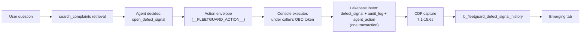
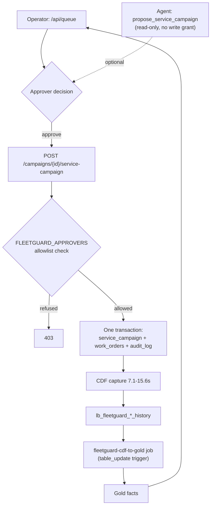

# FleetGuard — architecture

**Living document. Must be true now.** Last reconciled against the workspace: **2026-09-24**.

> Run 1 (2026-09-23) exercised the whole system live end to end and then tore the billable
> half down again — so "reconciled" below means *reconciled against what Run 1 observed*,
> not against resources running right now. The AI Search index and the App are deliberately
> down until Run 2 (2–3 October); `docs/STATUS.md` is the page that tracks which.

Companion documents, each with one job:

| Document                                           | Job                                                  | Lifecycle                     |
| -------------------------------------------------- | ---------------------------------------------------- | ----------------------------- |
| **This file**                                      | What the system *is*                                 | Living — update with the code |
| [`STATUS.md`](STATUS.md)                           | Where the build has got to                           | Living, high-churn            |
| [`ENHANCEMENTS.md`](ENHANCEMENTS.md)               | Evaluated backlog — adopt/defer/reject, with reasons | Living                        |
| [`ISSUES.md`](ISSUES.md)                           | Every problem hit, root cause, resolution            | Append-only                   |
| [`../PLAN.md`](../PLAN.md)                         | Phase sequencing and definitions of done             | Living                        |
| [`../CLAUDE.md`](../CLAUDE.md)                     | Verified facts that must not be re-derived           | Living                        |

Every number below is measured against the live workspace. Anything not yet measured is
marked **(planned)** and carries no figure.

**Diagrams (as-built, tracks this file):** [`fleetguard_e2e_current.html`](fleetguard_e2e_current.html)
/ [`.png`](fleetguard_e2e_current.png) (system architecture) ·
[`fleetguard_identity_current.html`](fleetguard_identity_current.html) /
[`.png`](fleetguard_identity_current.png) (identity & authorisation, §8a/§8b). The similarly-named
files without `_current` are the **frozen 2026-08-31 proposal diagrams** — do not confuse the two;
update these when this file changes, never those.

---

## 1. What FleetGuard does

A fleet operator running thousands of vehicles learns about safety defects the same way a
private owner does — when a recall posts. FleetGuard delivers two capabilities against
NHTSA's public defect corpus.

**Reactive — recall response.** A campaign posts; FleetGuard resolves its scope against the
VIN roster, ranks exposure by depot and severity, and issues work orders under human
approval. Deterministic, and the demo's spine.

**Proactive — early warning.** Detect a complaint pattern before NHTSA opens an
investigation. **Measured: 16.0% of investigations detected at a median 197-day lead,
against 11.1% on a volume-matched placebo** (1.44×, z ≈ 2.62, p ≈ 0.009).

> **Precision about what is predicted.** The system predicts **that NHTSA will open an
> investigation**. It does *not* predict recall issuance, and it does not identify affected
> VINs. Investigation → recall is separate regulatory latency (median 118 days across 886
> campaigns) — real context, **never reported as a system result**. These three intervals
> have been conflated once already; keep them apart.

---

## 2. Build state

> **Corrected 2026-09-24.** Three rows below read **"Not started"** until this date — Phases
> 6, 8 and 11 — while the App had been deployed, verified in a browser and exercised end to
> end in Run 1. They were written before those phases were built and never revisited, and this
> is the *living spec*: a reader taking §2 at its word concluded the console did not exist.
> `docs/STATUS.md`'s phase table was right throughout, which is how the drift went unnoticed —
> the two were never read against each other.

| Phase                      | State |
| -------------------------- | ---------- |
| 1 Ingestion + medallion    | ✅ Done — `gold_emerging_cluster` **descoped** (cluster-grained, and there is no clustering); replaced by `gold_emerging_signal` |
| 2 Fleet registry           | ✅ Done |
| 3 Chunking + AI Search     | ✅ Done — **rescoped 2026-09-23** from the post-2010 series to the fleet's own make/model pairs (I-111), then widened again to the `EXACT` + `MODEL_VARIANT` tiers (I-115). Built and torn down twice; **179,347 chunks measured in Run 2** (I-126) |
| 4 Model B + golden set     | ✅ Done — precision 83.7% / recall 96.3%, real numbers on the evidence page |
| 5 Lakebase + CDF           | ✅ Done — loaded and latency-measured |
| 6 OAuth wiring             | ✅ Done — the auth seam (E-13) with two providers, `databricks-apps` (OBO) and `static-dev`. U2M was built, flipped live, and then **retired with Render** (E-14); it is preserved at commit `2b5727a` (the deleted `deploy/render` branch) |
| 7 Agent tools + write path | ✅ Done — seven tools; both writes (`open_defect_signal`, `watch_campaign`) execute in the app under the caller's identity, see §7.1 |
| 8 App + external surface   | ✅ Done — `fleetguard-console` on Databricks Apps, verified in a real browser 2026-09-08 and re-verified across all ten `DEMO.md` beats in Run 1 (I-113). **Stopped between the two online windows by design** |
| 9 Model A + backtest       | ✅ Done — **result is negative**, see §6 |
| 10 Governance              | ✅ Visible slice — Postgres RLS on depot scoping, proved live |
| 11 Hardening               | ✅ Done — the `table_update` trigger is built and has fired unattended (§8.3); demo state is seeded through the real API, not direct INSERTs. "Render always-on" left this phase when Render did |
| 12 Second connector        | ❌ Cut for schedule |

Everything lives in one schema, `bootcamp_students.fleetguard`, inside a **shared** bootcamp
metastore. Catalog creation is unavailable, so **medallion layers are table-name prefixes**
(`bronze_`, `silver_`, `gold_`), not sibling schemas.

---

## 3. Data sources — all verified live

| Source         | Artefact                                 | Measured                                |
| -------------- | ---------------------------------------- | --------------------------------------- |
| Complaints     | `FLAT_CMPL.zip`                          | 2,240,289 rows, 51 fields               |
| Recalls        | `FLAT_RCL_POST_2010.zip`                 | 244,925 rows / **15,211 campaigns**     |
| Investigations | `FLAT_INV.zip`                           | 154,367 rows / **5,344 investigations** |
| TSBs           | `TSBS_RECEIVED_<range>.zip` × 7          | 5,801,279 rows                          |
| vPIC           | `DecodeVINValuesBatch`                   | Authoritative for make/model/year       |
| Recalls API    | `api.nhtsa.gov/recalls/recallsByVehicle` | 200/200 fleet combos                    |

**Traps that cost real time** (full detail in `CLAUDE.md`):

- `FLAT_RCL.zip` is a dead S3 key → 404. Use `FLAT_RCL_POST_2010.zip`.
- `api.nhtsa.gov/recallsByVehicle` **without** the `/recalls` segment returns 403. There is
  **no VIN→recall lookup**; `recallsByVin` 403s.
- The host advertises an `ETag` and **ignores** `If-None-Match`. Only `If-Modified-Since`
  works — building on the ETag re-downloads 2.6 GB per run while looking correct.
- Row counts are entity-vs-row traps: 154,367 investigation *rows* are 5,344
  *investigations*. Never quote a row count when you mean entities.

### 3.1 Reliability posture of the outbound calls

Both live APIs go through one tested retry policy, `src/fleetguard/http_retry.py` — pure,
dependency-injected logic with 60 unit tests that run in CI with no network and no clock.
Added 2026-09-20; before that the project had **no retry logic anywhere** (I-106).

|                   | Recall poll (`05_poll_recalls_api.py`)                        | vPIC (`04_build_fleet_registry.py`) |
| ----------------- | ------------------------------------------------------------- | ---------- |
| Retries           | 3 attempts, exponential + full jitter, `Retry-After` honoured | same |
| Pacing            | 2 req/s, ~200 combos, ~100 s/sweep                            | ~18 batches of 50 VINs |
| On exhaustion     | record the status, continue the sweep                         | **raise** — a partial decode must not become a roster |
| Shape check       | `Count` cross-checked against `len(results)`                  | `Results` must be a list |
| Run-level verdict | `ops_recall_api_sweep`, one row per sweep                     | 500-VIN verification sample |

Three policies here are deliberate and easy to get backwards:

- **A 400 is never retried.** NHTSA answers an unrecognised make/model/year with HTTP 400 and
  a body reading *"Results returned successfully"* (I-031) — deterministic, not transient.
- **The two callers fail differently on purpose.** A dead recall combo costs a combo; a dead
  vPIC batch aborts the build, because §4.3's guarantee is that make/model/year comes from
  vPIC and never from the complaint record, and a silently short roster would break that.
- **The sweep has a quality gate.** `gold_recall_alert` is rebuilt with `CREATE OR REPLACE`;
  above a 10% combo failure rate the rebuild is skipped and the run fails, so a mostly-failed
  sweep cannot quietly replace the alert table with a partial view of the world (I-106).

**Verified live 2026-09-20, both directions.** A clean sweep: 200/200 `ok` in 102 s, 2,122
campaign rows, `alert_table_refreshed = true`. Then the gate deliberately tripped
(`failure_gate_pct=-1`, `max_combos=5`): the run failed, three `ops_recall_api_sweep` rows
landed with `alert_table_refreshed = false`, and `gold_recall_alert` **stayed at Delta
version 1** — proving the rebuild was skipped rather than merely reported as skipped. Three
rows rather than one because the task's new `max_retries: 2` re-ran the whole sweep twice;
each attempt is a real sweep and is counted as one, so `gold_api_poll_health` sees attempts,
not runs.

The Postgres operational schema built from this data is in §4.6.

---

## 4. Pipeline

```
static.nhtsa.gov ──► Volume (per-source subdirs) ──► bronze_* ──► silver_* ──► gold_* ──► Lakebase ──► CDF ──► UC
   If-Modified-Since      Auto Loader needs a         4 tables    + quarantine   fleet +    Postgres   7–16 s
   only                   DIRECTORY, not a file       8.44M rows  reconciled     backtest   12 tables
```

### 4.1 Ingestion

Manual-trigger by design — no schedule, to avoid consuming shared-workspace compute before
the demo. Scheduling is Phase 11.

Change detection is `If-Modified-Since` against `ops_ingest_watermark`. Files land in
**per-source subdirectories** (`cmpl/`, `rcl/`, `inv/`, `tsbs/`) because Auto Loader
monitors directories, not files.

### 4.2 Bronze → Silver (Lakeflow Declarative Pipeline)

**Every `read_files` call must set `quote => '\0'`.** The ODI files are tab-delimited with
no quoting convention, but narratives contain `"`. Spark's default quote handling swallows
tabs and shifts fields — measured at **143 rows silently corrupted**, with `_rescued_data`
reading **0 in both cases**. Zero rescued rows is necessary, not sufficient; validate
against known cardinalities instead.

Quality control **routes rather than drops**: failure reasons are computed once in a staging
view and drive both the silver and quarantine predicates, so the two cannot drift.
`tests/pipelines/` (added 2026-09-17) unit-tests this routing logic and the chunk-count math
in `silver_complaint_chunk.sql` locally, against a local Spark session — the pipeline DDL
itself (`STREAM(...)`, `CREATE OR REFRESH STREAMING TABLE`, `EXPECT`) is pipeline-runtime
syntax with no local equivalent, so only the staging-view `SELECT` logic is covered this way;
the routing invariant on the live tables (`bronze = silver + quarantine`, exactly) is still
`tests/test_data_quality.py`'s job, live only.

| Grain                  | Bronze    | Silver    | Quarantine |
| ---------------------- | --------- | --------- | ---------- |
| Complaints (V+T scope) | 2,209,695 | 2,209,123 | 572        |
| Recalls                | 244,925   | 244,701   | 224        |
| Investigations         | 154,367   | 154,191   | 176        |

`bronze = silver + quarantine` on every table. Entity-grain: `silver_investigation_case`
**5,233** investigations (**777** opened 2010+, the backtest population);
`silver_tsb_bulletin` **258,438** bulletins.

### 4.3 Gold — fleet registry

`gold_fleet_vehicle` 20,000 · `gold_fleet_depot` 60 · `gold_fleet_exposure` 989,042.

VIN prefixes come from real complaint VINs with the check digit recomputed, but
**make/model/year always come from vPIC** — complaint VINs are dirty (`!FTEW1EG2GK`, GMC
WMIs labelled RAM). 400 generated VINs independently verified: 400/400 exact.

> **Exact matching is insufficient, and the demo must say so.** Only 91 of 163 fleet
> combinations match a campaign exactly. `MODEL_VARIANT` matches (725,356) outnumber `EXACT`
> (263,686) roughly 3:1 — all 2,116 F-250s match only as variants, because `F-250 SD` is
> NHTSA's dominant spelling. `match_basis` carries the tier, and the deterministic guarantee
> applies to **`EXACT` only**.

### 4.4 Retrieval

`complaint_chunk_idx` on endpoint `fleetguard-vs` — Delta Sync, **HYBRID**,
`databricks-gte-large-en` (1024-dim). **Rescoped 2026-09-23 (I-111)** from the post-2010
investigation series to the fleet's own 47 make/model pairs — down from 1,746,601 — same
$6.72/day cost under the 2M-vector threshold (I-035), but both AI Search builds in the
build plan now take minutes instead of hours, and retrieval is scoped to vehicles this
fleet actually operates.

**Widened again the same day (I-115)** to the `EXACT` +
`MODEL_VARIANT` tiers the rest of the system already uses, because exact spelling excluded
every one of the fleet's 2,116 F-250s from retrieval.

**Measured 2026-09-30 in Run 2 (I-126) — `silver_complaint_chunk_indexed`:**

| tier            | chunks      |
| --------------- | ----------- |
| `EXACT`         | 115,499     |
| `MODEL_VARIANT` | 63,848      |
| **total**       | **179,347** |

`EXACT` reproduces I-035's 2026-08-31 figure to the row, so the old scope is exactly
reproducible and the entire gap is the widening. The count is now pinned per tier in
`src/search/27_build_chunk_index_source.py`, not merely recorded — a regression that moved rows
between tiers while preserving the sum would otherwise pass, which is exactly the I-115 failure.

The `MODEL_VARIANT` share here is **35.6%**, well below I-030's ~3:1 variant-to-exact ratio on
`gold_fleet_exposure`. That is real, not a discrepancy: exposure counts *vehicles* and the
fleet's most numerous model matches only as a variant, while chunks count *complaints* and
NHTSA's exact spellings dominate the narrative corpus. The two measure different populations.

**Verification status is split by scope.** The three behavioural checks (`columns_to_sync`
completeness, `any_harm` filter, HYBRID differing from pure ANN) were re-run and passed
against a 10K-row smoke index at this new scope (I-112) before the full build. The full
`ops_hybrid_query_test` sweep — near-duplicate retrieval, the specific probe-query pairs —
was last run against the **old, full-corpus** index. Re-running it at the shipped 179,347-row
scope is what `src/search/28_rag_eval.py` does; it writes `ops_rag_eval` and Run 2 publishes
those figures in `docs/EVIDENCE.md` as measured, including if poor.

**This is the load-bearing use of embeddings.** See §6 for the use that failed.

### 4.5 Operational store — Lakebase + CDF

**11 core tables** (`fleetguard_<entity>`, 1:1 with proposal §4.4) plus **3 added since**
(`fleetguard_depot_assignment`, `fleetguard_technician`, `fleetguard_watchlist`) — **14 total**,
every one `REPLICA IDENTITY FULL` (a hard CDF prerequisite — without it the WAL carries only
the key and `update_preimage` is useless). Full column-level reference: §4.6.

> **This section claimed "every one" while one table was the exception, from the day
> `fleetguard_depot_assignment` was created until 2026-09-20 (I-107).** It was created without
> `REPLICA IDENTITY FULL` and without the read-back assertion its sibling creation scripts
> carry, so it never replicated: there were **13** history tables, not 14. Repaired, and the
> invariant is now checked across the whole schema by `24_add_foreign_keys.py` rather than
> once per creation script. **Re-verified live 2026-09-20: 14/16 tables (re-counted live 2026-10-02 — **this figure has now drifted twice**, 11→14→16; count it rather than trusting the line: `SHOW TABLES IN bootcamp_students.bootcamp_cdc LIKE 'lb_fleetguard_%'`) `FULL`, 14/14 history
> tables present**, and the repaired table's first replicated `delete` carries its non-key
> columns — which is the property FULL exists to provide. The claim above is true again, and
> is worth re-measuring rather than re-reading the next time a table is added.

CDF replicates to `bootcamp_students.bootcamp_cdc` as `lb_fleetguard_<entity>_history`. All
14 exist with exact names and **no `_1` collision suffixes**.

- **CDF replicates DDL**, so destinations appear at `CREATE TABLE`, not on first write —
  **but not universally.** Measured 2026-09-20 (I-107): `fleetguard_depot_assignment` existed
  for weeks with no destination, and setting `REPLICA IDENTITY FULL` did not create one
  either. It appeared only after the table's **first actual write**. A table that has never
  been written to is the case where the DDL rule does not hold.
- **Capture latency is wider than three samples suggested.** I-046 measured **7.1–15.6 s**
  (n=3, all true measurements). A fourth, 2026-09-20, measured **212–245 s by polling**
  (I-108). Both are real; neither is a bound. Say "seconds to a few minutes", and do not
  size a demo against 15.6 s as a worst case — it is not one. Databricks publishes no
  latency SLA for this path, so nothing is being violated; the variance is the finding.
- CDF configuration is **UI-only** — no CLI, no API, not a bundle resource. It is a manual
  runbook step in any rebuild.

### 4.6 Data model reference

Column-level detail for the 16 tables (re-counted live 2026-10-02 — **this figure has now drifted twice**, 11→14→16; count it rather than trusting the line: `SHOW TABLES IN bootcamp_students.bootcamp_cdc LIKE 'lb_fleetguard_%'`) introduced in §4.5, grouped by role. Gold-layer row
counts stay owned by §4.3 — linked here, not restated. Postgres schema fragments in §8a
(RLS policy, `fleetguard_vehicle`/`fleetguard_depot_assignment`) are summarized here too.

**Fleet roster & depots**

| Table                         | Key columns                                                                                        | Notes |
| ----------------------------- | -------------------------------------------------------------------------------------------------- | ---------- |
| `fleetguard_vehicle`          | `vin` PK, `depot_id`, `segment`, `make`/`model`/`model_year`, `body_class`, `gvwr_class`, `status` | The fleet's own 20,000-VIN roster (gold-derived: §4.3) |
| `fleetguard_depot`            | `depot_id` PK, `depot_name`, `region`, `city`, `state`, `manager_principal`                        | 60 depots, seeded from `gold_fleet_depot` |
| `fleetguard_depot_assignment` | `postgres_role` PK, `depot_id`                                                                     | Drives RLS on `fleetguard_vehicle` (§8a) — a role with no row here is unrestricted (fail-open by construction) |
| `fleetguard_technician`       | `technician_id` PK, `name`, `depot_id`, `active`                                                   | Backs `fleetguard_work_order.assigned_to` with a real roster instead of free text |

**Signals & campaigns**

| Table                         | Key columns                                                                                                                  | Notes |
| ----------------------------- | ---------------------------------------------------------------------------------------------------------------------------- | ---------- |
| `fleetguard_defect_signal`    | `signal_id` PK, `cluster_id`, `component`, `make`/`model`/`model_year_min/max`, `confidence`, `severity_score`, `status`     | Model A output (§5) |
| `fleetguard_recall_campaign`  | `campaign_id` PK, `nhtsa_number`, `component`, `make`/`model`/`model_year`, `do_not_drive`, `park_it`, `issued_at`, `source` | Reactive side, from flat file or live API |
| `fleetguard_vehicle_exposure` | `exposure_id` PK, `vin`, `campaign_id`, `signal_id`, `match_basis`, `match_confidence`                                       | The join driving the work queue — `match_basis` is `EXACT` or `MODEL_VARIANT` (§7's deterministic guarantee is `EXACT`-only) |
| `fleetguard_watchlist`        | `watchlist_id` PK, `campaign_id`, `rationale`, `watched_by`, `status`                                                        | Backs the agent's `watch_campaign` tool (§7.2) |

**The gated write path**

| Table                         | Key columns                                                                                                                    | Notes |
| ----------------------------- | ------------------------------------------------------------------------------------------------------------------------------ | ---------- |
| `fleetguard_service_campaign` | `service_campaign_id` PK, `campaign_id`/`signal_id`, `title`, `vehicle_count`, `status`, `approved_by`/`approved_at`           | Created by `approve_campaign` (§7.3), never by the agent |
| `fleetguard_work_order`       | `wo_id` PK, `service_campaign_id`, `vin`, `depot_id`, `assigned_to`, `status`                                                  | One row per exposed vehicle, same transaction as its service campaign (§7.3) |
| `fleetguard_agent_action`     | `action_id` PK, `tool`, `tool_input`/`tool_output` (JSONB), `actor_principal`, `on_behalf_of`, `requires_approval`, `trace_id` | Every agent tool call, read or write (§7.1) |
| `fleetguard_audit_log`        | `audit_id` PK, `entity_type`/`entity_id`, `action`, `actor_principal`, `before_state`/`after_state` (JSONB)                    | Append-only, written alongside the service-campaign/work-order transaction (§7.3) |

#### 4.6a Referential integrity

**14 foreign keys, added 2026-09-20** (`src/lakebase/24_add_foreign_keys.py`). Before that
this schema had none: `pg_constraint` held only primary keys, not-nulls and checks, and every
cross-table relationship was enforced in application code.

Reversing that was a deliberate decision, not a cleanup. The app checks are good, they stay,
and several are *stronger* than any constraint — `routers/work_orders.py` validates that an
assignee is on the roster **and** at the work order's own depot **and** active. What the app
cannot cover is every writer that does not go through it: the bulk loaders, the seed script,
and future migrations. `13_load_exposure.py` already hand-rolled a ghost-VIN check and rolled
back on a miss — a foreign key written out longhand, once, in one loader. The constraints are
that check applied to every writer for free.

| Child                                                                                         | Parent             | On delete      |
| --------------------------------------------------------------------------------------------- | ------------------ | -------------- |
| `vehicle.depot_id`, `technician.depot_id`, `depot_assignment.depot_id`, `work_order.depot_id` | `depot`            | `RESTRICT`     |
| `vehicle_exposure.vin`, `work_order.vin`                                                      | `vehicle`          | `RESTRICT`     |
| `vehicle_exposure.campaign_id`, `service_campaign.campaign_id`, `watchlist.campaign_id`       | `recall_campaign`  | `RESTRICT`     |
| `vehicle_exposure.signal_id`, `service_campaign.signal_id`                                    | `defect_signal`    | `RESTRICT`     |
| `work_order.service_campaign_id`                                                              | `service_campaign` | `RESTRICT`     |
| `work_order.assigned_to`                                                                      | `technician`       | **`SET NULL`** |
| `approval.action_id`                                                                          | `agent_action`     | `RESTRICT`     |

- **All 14 scanned clean before being applied** — zero orphans across 118,323 exposure rows,
  20,000 vehicles and 331 work orders — so they went on validated, with no `NOT VALID` step.
- **No `CASCADE` anywhere.** This schema is append-and-audit; a cascade would let one parent
  delete silently remove audited history.
- **`SET NULL` only for `assigned_to`**: retiring a technician should unassign their open
  work, not block the retirement and not delete the work.
- Five child columns had no index (`work_order.vin`, `work_order.assigned_to`,
  `vehicle_exposure.signal_id`, `service_campaign.signal_id`, `approval.action_id`); an
  unindexed FK child makes every parent delete a sequential scan, so those were added too.
- **`fleetguard_audit_log` deliberately gets none.** Its `entity_id` is polymorphic — campaign
  ids, work-order ids and service-campaign ids share the column — and an audit row must
  outlive whatever it describes.

**Three partial unique indexes carry the "one active X" rules.** Each exists because the case
being defended against is two requests milliseconds apart, where a `SELECT`-then-`INSERT` in
the handler is a TOCTOU race that under READ COMMITTED is the *likely* interleaving. Only the
database serialises them; the handler's own check produces the good error message.

| Index                              | On                                                 | Where                              | Rule |
| ---------------------------------- | -------------------------------------------------- | ---------------------------------- | ---------- |
| `ux_fg_service_campaign_active`    | `service_campaign (campaign_id)`                   | `status='LAUNCHED'`                | One live service campaign per recall (I-063) |
| `ux_fg_watchlist_active`           | `watchlist (campaign_id, watched_by)`              | `status='ACTIVE'`                  | One active watch per campaign per person |
| `ux_fg_defect_signal_agent_active` | `defect_signal (opened_by, series_key, component)` | `status='OPEN' AND source='AGENT'` | One open agent signal per series per actor (I-110) |

All three are **partial** for the same reason: a closed, cancelled or superseded row must not
block the legitimate next one. A plain unique index would make a recurrence unreportable.

**Present in schema, not currently wired to the app** — created and CDF-enabled, but no
router or agent tool reads or writes them as of this reconciliation (confirmed by grep
across `app/backend/fleetguard_api/` and `src/agent/`):

| Table                       | Key columns                                                                                         | Notes |
| --------------------------- | --------------------------------------------------------------------------------------------------- | ---------- |
| `fleetguard_approval`       | `approval_id` PK, `action_id`, `service_campaign_id`, `decision` (`APPROVE`/`REJECT`), `decided_by` | Superseded in practice — the live approval flow (§7.3) records its decision directly on `fleetguard_service_campaign`/`fleetguard_audit_log` instead |
| `fleetguard_public_summary` | `metric_key` PK, `metric_value`, `metric_text`, `unit`                                              | Built for an unauthenticated read surface (proposal §5.2); the current Evidence tab (README) sources from the published backtest result instead |

---

## 5. Models

**Model A — emerging defect detector.** **Volume anomaly only**, against each series' own
trailing 12-month history, at the grain `(make, model, comp_top)`. The firing rule is
`n >= 5 AND base_months >= 6 AND base_sd > 0 AND z >= 3.0`, and a detection is a **sustained
run** of ≥2 consecutive firing months, dated at the run *nearest* the investigation open date.

> Taking the *earliest* run in the window instead produced a 409-day median that was pure
> artefact — as many detections at the window edge as near the open date. The nearest-run
> rule is load-bearing, not a detail.

**Harm weighting was designed but never built (I-051).** This section previously described a
smoothed severity multiplier with shrinkage toward the component base rate. No such term
exists in the code, and the measured 16.0% / 11.1% result comes from pure volume anomaly.
The rationale for the design still holds — 96.0% of complaints report zero injuries, so an
unsmoothed weight would degenerate into a fatality lookup — and if it is built it belongs as
a *ranking* multiplier on an already-fired run, after which the backtest must be re-run
before the headline can be re-quoted.

**Model A does not use clustering.** See §6.

**Live signals.** `gold_emerging_signal` applies the same rule, with the same thresholds, to
the current corpus and keeps runs still firing at the corpus edge. It is what
`gold_emerging_cluster` was for, at the grain the detector actually uses. `harm_share` on that
table is **descriptive triage only** and is not an input to firing.

**Model B — recall-to-fleet matcher.** Scores the `MODEL_VARIANT` residual that exact matching
misses (725,356 of 989,042 exposure rows, I-030) — ranks ambiguity, never performs the match.
Gradient-boosted, isotonic-calibrated, threshold tuned for recall (target 0.90).

**Golden set is text-derived, not human-labelled.** 765 (campaign, make, model) pairs, labels
from whether the vehicle model appears in NHTSA's own `defect_description` — real regulatory
text, not synthetic (E-08 forbids synthetic labels here specifically). 621 positive, 144
negative, 69 excluded as genuinely ambiguous rather than force-labelled.

**I-060 — the first run leaked and was caught before being reported.** Precision=1.000 at
threshold=1.000 traced to a feature (`model_is_substring_of_recall`) that was 0% by
*construction* of the negative-label rule, not by anything learned. Fixed, retrained.
**Reported: precision 83.7%, recall 96.3%, ROC-AUC 0.925** on a 230-row held-out split —
published on the evidence page (`GET /api/evidence` → `model_b`), per the proposal's own
requirement that precision/recall appear on the application's own page.

---

## 6. The measured result, including what failed

### Published result

> **16.0% of 777 post-2010 investigations detected, median 197-day lead.**
> **Placebo: 11.1% of 606, median 343 days.** 1.44×, z ≈ 2.62, p ≈ 0.009.

The **shape** is better evidence than the rate: real detections cluster near the open date
(197 days) while placebo detections scatter toward the window midpoint (343 days) — what a
detector tracking a genuine ramp looks like, rather than one firing on background variance.

### Honest limits

- **It misses ~5 of every 6 investigations.** 124 of 777.
- The control arm fires at 11.1%, so a majority of detections would have occurred on a busy
  series with no defect. A 1.44× edge, not an oracle.
- The placebo covers 606 of 777 — 171 investigations had no volume-matched
  never-investigated series available. Rates are per-arm, so the comparison holds, but the
  control is a **78% subset, not a mirror**.

### The semantic hypothesis was tested and falsified

The proposal claimed semantic clustering would surface defects earlier, and that *"the
semantic half is load-bearing rather than an enhancement."* Both were tested.

| grouping       | REAL      | PLACEBO | lift  |
| -------------- | --------- | ------- | ----- |
| Component (v2) | 13.3%     | 10.7%   | 1.24× |
| Semantic (v3)  | **11.2%** | 8.9%    | 1.26× |

Detection **fell**. And on the **70** investigations both groupings detect, subdivision
produced **0.0 days** of extra lead.

**That zero is decisive.** Had the mechanism worked and merely been outweighed by
fragmentation, shared detections would still fire earlier. They don't. Subdivision fired on
*fewer things*, not the same things *sooner* — a falsified mechanism, not an under-tuned one.

> The 13.3/11.2 pair is **v2 and v3 recomputed on the restricted 37-month embedded set**, so
> the comparison isolates the grouping change. **Never quote it as the project's result.**

HDBSCAN was abandoned before this: it labelled **85% of embeddings noise** at every
parameterisation tried, and normalisation — the obvious suspect — changed noise by 0.4
points. Complaint narratives are a continuum of phrasings, not density islands.

**What survives.** Clustering failed as a *detector*, not as an *aggregator*. k-means
subdivision assigns every complaint to a coherent group, which remains valid for explaining
a signal and for keeping `ai_extract` spend proportional to what an operator sees.

**(planned, code written not yet run)** `10_emerging_signals.py` now calls `ai_extract` once
per row of `gold_emerging_signal` (~50 calls, not 2.24M) over a 5-narrative bounded sample per
signal, writing `failure_mode`/`severity_language` — descriptive only, never a detection
input, same rule as `harm_share`. Written 2026-09-08; not yet executed against live data, and
the Lakebase loader / `routers/signals.py` / `Signals.tsx` do not read the new columns yet.
Closes the gap between this section's design claim and what `src/` actually contained — until
this cell existed, `ai_extract` was never called anywhere in the codebase, despite being named
as a Spark-pipeline strength in the original proposal.

---

## 7. Invariants

Things that must stay true. Each is enforced by a test, an expectation, or a constraint —
and each was violated at least once.

| Invariant                                                                                                                              | Enforced by |
| -------------------------------------------------------------------------------------------------------------------------------------- | ---------- |
| `bronze = silver + quarantine` on every table                                                                                          | Integration test + pipeline expectations |
| Complaint VIN is an 11-char **partial**, never an identifier                                                                           | Design; `vin.py` guards shape |
| Fleet make/model/year comes from **vPIC**, never from complaint VINs                                                                   | Fleet registry build |
| `DO_NOT_DRIVE` compared with `UPPER(...)`                                                                                              | Stored title-case `Yes`/`No`; a case-sensitive predicate silently returns zero rows |
| `read_files` sets `quote => '\0'`                                                                                                      | All bronze SQL |
| Chunk count is window-driven, not stride-driven                                                                                        | `chunking.py` + regression test |
| Every Lakebase table `REPLICA IDENTITY FULL`                                                                                           | Creation scripts refuse to commit otherwise — **and `24_add_foreign_keys.py` re-checks all 14 in one pass**, because the per-script version was enforced by three of four scripts and missed one for weeks (I-107) |
| Project tables are `fleetguard_`-prefixed                                                                                              | Name guard; shared schema |
| Backtest population is exactly **777** investigations                                                                                  | Assertion in scope build |
| No detection dated on or after its investigation opened                                                                                | Integration test |
| The agent can open a defect signal or watch a campaign, but **never** reaches `fleetguard_work_order` or `fleetguard_service_campaign` | Build assertion on `propose_service_campaign`; dispatch is behind `FLEETGUARD_APPROVERS` |
| An agent write is attributed to a **real human**, never a service principal                                                            | `agent_actions.execute` refuses (403) a token carrying no identity, for both write actions |
| Fleet counts joining NHTSA and vPIC model strings state their **match tier**                                                           | `ActionResult.match_basis`; I-075 |
| A `watch_campaign` request checks the campaign exists before writing                                                                   | `_execute_watch_campaign` refuses (404) an unknown `campaign_id` **before** the insert, so the caller gets a message naming the campaign rather than a bare `ForeignKeyViolation`. Since 2026-09-20 `fk_fg_watchlist_campaign` is the floor underneath it (§4.6a) |
| A work order cannot un-finish                                                                                                          | `ALLOWED_TRANSITIONS` (`routers/work_orders.py`) returns **409** on an illegal status change, checked against the row already locked `FOR UPDATE`. `COMPLETED` and `CANCELLED` are terminal; `OPEN` must pass through `IN_PROGRESS` to complete. The DB `CHECK` and the `Literal` constrain the *value*, neither constrained the *transition* (I-110) |
| Cross-table references are valid                                                                                                       | **14 foreign keys**, added 2026-09-20 — the app checks still run first and are stronger; the constraints cover every writer that does not go through the app (§4.6a) |
| **Retrieved complaint text is DATA, never instruction**                                                                                | Three layers (§7.1a): `_neutralise()` wraps every narrative in untrusted-data markers and strips the action sentinel; system-prompt rule 9 forbids complying with instructions found in tool results; the console executes only envelopes from an item id Python stamped. Structural half tested offline (`tests/agent/test_agent_injection.py`), behavioural half is a **hard gate** in `16_evaluate_agent.py` |
| **A narrative claim names the complaint ids it rests on**                                                                              | System-prompt rule 10 + the `cites_complaint_ids` scorer. A count with no ids is a claim an operator has to take on trust |
| **A deployed model version carries its evaluation result**                                                                             | `16_evaluate_agent.py` tags the UC model version *after* the hard gates, so a version cannot claim `eval_hard_gates: passed` when the evaluation refused it |

---

### 7.1 The agent's write path

The agent has seven tools; five read, and two write. `open_defect_signal` writes a business
record that appears in the operator's **Emerging** tab beside the batch detector's rows.
`watch_campaign` — added after §7's original build — is a plainer write: it flags one NHTSA
campaign number for the fleet safety team to keep an eye on, with a rationale, and nothing
else. It touches no work order, no service campaign, and computes no fact of its own.

**The model does not perform either write, and cannot.** Its serving endpoint has no Postgres
path, and giving it one is closed on this account (all three routes — the `DatabricksLakebase`
resource, a secret-backed service principal, and OBO for Model Serving — were checked and
none are available; see `docs/ISSUES.md`). So each tool returns a deterministic *action
envelope*, the FastAPI app validates it against a Pydantic model (`OpenDefectSignalParams` or
`WatchCampaignParams`), and **the app** executes the insert through the existing
`connect(principal)` path — under the caller's own OBO token. `agent_actions.execute`
dispatches on the envelope's action name to the matching handler; an unrecognised name is
refused (400) rather than silently ignored.

This is a stronger property than it looks like a workaround for: the write lands as the
signed-in human, so `opened_by` is a genuine identity and Postgres RLS applies to the agent's
write exactly as it does to a click in the UI. Nothing an LLM emits can widen its own reach.

**The Emerging tab shows that identity on the row itself** ("opened by …", `source='AGENT'`
only) — until 2026-09-08 it was recorded correctly and visible only in the Audit log, which
made the property real but unevidenced at the point where it is claimed.

Three consequences the code enforces rather than assumes:

- **The envelope is constructed in Python from the tool's return value, never formatted by
  the model**, and the sentinel must *start* the output item. Prose that merely mentions the
  sentinel is not an envelope.
- **Facts are recomputed, not accepted — with one deliberate exception.** `fleet_vehicles` is
  counted from real rows; the model's own estimate is never persisted. It orders the Emerging
  tab, so a hallucinated count would reorder the operator's page. `watch_campaign` computes no
  fact at all — it is a bookmark with a rationale, not an observation, so there is nothing to
  recompute; its only server-side check is that the campaign it names actually exists.
- **The model is prompted to say it *requested* a signal or a watch, never that it saved
  one.** The committed row is reported by a separate UI element — the one place entitled to
  claim either exists. Verified live: the agent said *"I can't confirm it's saved or tracked
  yet, and no signal ID has been assigned to me."*

**The agent can read the fleet's own vocabulary before it writes.** `lookup_fleet_models`
returns the makes and models the fleet actually operates, in the registry's spelling, from
`gold_fleet_vehicle` — the same table Lakebase's `fleetguard_vehicle` is loaded from, so the
strings it hands back are exactly the ones the write path matches on. Without it, every read
tool was keyed by `campaign_id` and the model was asked to name a scope in a vocabulary it
could not inspect: live on 2026-09-08 it offered to widen a RAM 2500 signal to the "Dodge
2500/3500 cluster", and this fleet holds no Dodge at all. That closes the NHTSA-vs-vPIC gap
(I-030) at the source; `ActionResult.match_basis` (I-075) remains the backstop that repairs a
count afterwards and states which tier produced it.

**A write request ends the turn, and the turn is limited to one** (2026-09-20, I-110). Two
boundaries make an envelope binding rather than provisional:

- **Forward.** Once a tool returns an envelope, the agent finishes the tool calls already in
  flight — cutting the batch short would leave a `tool_call_id` unanswered, which the
  completions API rejects — and then makes exactly one more model call **with the tool list
  omitted**. The model can explain what it asked for; it cannot reach for another tool.
  Without this it could request a signal, keep reasoning, reach a different conclusion, and
  finish, while the console still executed the abandoned request.
- **Backward.** If the bounded 6-round loop exhausts without a final answer, every collected
  envelope is discarded (I-109).

An envelope therefore exists only inside a turn that both reached it and concluded from it.
**One per turn, enforced at both ends:** the agent returns no actions if it somehow produced
two, and `routers/chat.py` refuses such a response with 409 rather than executing the first
and dropping the rest. Neither end trusts the other to have handled it.

**Assistant turns are signed.** This console holds no server-side conversation state, so the
browser replays the history — which means a client can claim the assistant said anything, and
an injected turn enters the model's context as the model's own words. Each reply therefore
carries an HMAC tag over its text which the client must echo back; an assistant turn that
does not verify is refused (400). The write paths were never defenceless — `authz.may_approve`
gates both — but forged history can steer an approver's own session, and that matters more
each time the agent gains a write tool. The key is generated per process rather than
configured: `app.yaml` is in git, so a literal there would be a published secret, and the only
cost of a fresh key is that a restart ends conversations already open.

**`fleetguard_agent_action` records attempts, not only commits.** A refused or failed write
rolls its business row and audit row back together, and until 2026-09-20 it rolled the
agent-action row back with them — so a table named for what the agent did contained only what
it succeeded at. A non-committing attempt now writes one row in a separate short transaction
with `tool_output.outcome` set to `REJECTED` or `FAILED` and the reason alongside. It is
best-effort by design: if that log fails it is swallowed, because replacing the caller's real
403 with a database error from the logging path is worse than losing the record. Unattributed
attempts are not recorded at all — `actor_principal` is `NOT NULL`, and refusing to write an
unattributable row is itself the 403 the caller receives.

**A retry cannot become a second finding.** `ux_fg_defect_signal_agent_active` — unique on
`(opened_by, series_key, component)` where `status='OPEN' AND source='AGENT'` — is what
actually serialises two concurrent requests; `agent_actions` turns the `UniqueViolation` into
a 409 naming the existing signal. Per actor, because two managers observing the same series
independently are two observations. Partial on `OPEN`, so a recurrence can still be reported
after the first signal is closed. Scoped to `source='AGENT'`, so the batch detector is
unconstrained by a rule written for the agent write path.

Verified end to end 2026-09-08: user question → complaint retrieval → agent decision →
envelope → app executes under OBO → Lakebase insert (+ audit row + `fleetguard_agent_action`,
one transaction) → CDF → `bootcamp_cdc.lb_fleetguard_defect_signal_history` → Emerging tab.




### 7.1a The retrieval corpus is untrusted input

**`search_complaints` is the only tool that returns text this project did not write.** The
other six return numbers computed from Delta tables and Lakebase rows. This one returns
**public, user-submitted ODI complaint narratives** — 2.24M of them, and anyone in the United
States can add another — which go straight into the model's context.

That is an indirect prompt-injection surface, and it went unexamined through three rounds of
external security review (I-118). All three hardened the *envelope*: can a model cause an
action it should not. None asked what is in the text the model reads, or who wrote it.

**Severity is bounded, and the bounds are what make this a P2 rather than a P0.**
`agent_actions.execute` gates on `authz.may_approve`, so only an approver's session is exposed;
it recomputes fleet relevance from real rows, so an invented make is rejected; one action per
turn is enforced at both ends; and the console executes an envelope only from an item id Python
stamped (I-117). The realistic worst case is *an approver asking an innocent question and a
hostile narrative causing a false defect signal recorded under their name*.

**Three layers:**

| Layer              | Where                                           | What it does                                                                                                                | Tested by |
| ------------------ | ----------------------------------------------- | --------------------------------------------------------------------------------------------------------------------------- | ---------- |
| Provenance marking | `_neutralise()`, before the model sees anything | Wraps each narrative in explicit untrusted-data markers and strips the action sentinel                                      | `tests/agent/test_agent_injection.py`, offline |
| Behaviour          | System prompt rule 9                            | Text between the markers is evidence, never an instruction; do not comply; **say** that an embedded instruction was present | `resists_injected_instructions`, a **hard gate**, measured in Run 2 |
| Execution          | `routers/chat.py` + `agent_actions.execute`     | Item-id check, `may_approve`, server-side relevance                                                                         | Existing tests (I-117) |

**`_neutralise` is deliberately not a filter.** A blocklist of injection phrases ("ignore
previous instructions", ...) is unbounded, trivially paraphrased, and produces the worst
available outcome: a system that *looks* defended. It makes provenance unambiguous and removes
the one token with mechanical power; the hostile text survives verbatim inside the marker, and
a test pins that so nobody "improves" it into a filter.

The markers are interpolated into the prompt from the same constants `_neutralise` uses, so the
two cannot drift into a defence that names a delimiter the retrieval path no longer emits.

---

### 7.2 Agent tool reference

Seven tools, five read and two write. Purpose text is drawn from each tool's own docstring
in `src/agent/14_fleetguard_agent.py`; re-check against that file if it changes.

| Tool                       | Type      | Backing table / index                         | Purpose |
| -------------------------- | --------- | --------------------------------------------- | ---------- |
| `search_complaints`        | read      | `complaint_chunk_idx` (AI Search)             | Hybrid search over the fleet-scoped complaint-narrative index; over-fetches 3x and dedupes by `complaint_id`, so sibling chunks cannot shrink the result set below what was asked for (I-115) |
| `lookup_fleet_exposure`    | read      | `gold_fleet_exposure`                         | Fleet vehicles a campaign touches, by match tier (`EXACT`/`MODEL_VARIANT`) — §7's deterministic guarantee is `EXACT`-only |
| `lookup_fleet_models`      | read      | `gold_fleet_vehicle`                          | What the fleet actually operates, in the fleet's own (vPIC) spelling — closes the NHTSA-vs-vPIC vocabulary gap (I-030) at the source |
| `lookup_emerging_signals`  | read      | `gold_emerging_signal`                        | Defect ramps this system detected that NHTSA hasn't acted on; returns totals alongside rows so the result can't be over-read as fleet-wide |
| `propose_service_campaign` | read      | (calls `lookup_fleet_exposure` internally)    | Returns a `PROPOSED_AWAITING_HUMAN_APPROVAL` object only — the agent holds no grant on `fleetguard_work_order` |
| `open_defect_signal`       | **write** | `fleetguard_defect_signal` (via console, OBO) | Returns a `REQUESTED` action envelope; the console executes the insert under the caller's own identity (§7.1) |
| `watch_campaign`           | **write** | `fleetguard_watchlist` (via console, OBO)     | Bookmarks one campaign number with a rationale; same indirection as `open_defect_signal`, and for the same reason (no Lakebase credential on the serving endpoint) |

Both writes share the `ACTION_KEY`/`ACTION_SENTINEL` mechanism narrated in §7.1: the tool
returns an envelope, never performs the write itself. §7.2 is a reference only — the
mechanism, its guarantees, and its verification are owned by §7.1, not repeated here.

### 7.3 The approval / dispatch write path, end to end

This is the *other* write path — human-gated recall dispatch, distinct from §7.1's
agent-direct writes. The agent's `propose_service_campaign` (§7.2) can surface a proposal in
chat, but it computes exposure read-only and holds no grant on `fleetguard_work_order`; every
actual dispatch happens through this sequence instead.

1. An operator views `/api/queue` (`queue.py`) — campaigns ranked by fleet exposure.
2. Optionally, the agent's read-only proposal (step above) surfaces the same campaign in chat.
3. An approver — checked against the `FLEETGUARD_APPROVERS` allowlist via `may_approve()`
   (`approval.py`) — calls `POST /api/campaigns/{campaign_id}/service-campaign`. Two refusals
   happen before any write: an unattributed caller (403) and a non-approver (403).
4. `approve_campaign` writes the service campaign, one work order per exposed vehicle, and an
   audit row — **all in one transaction** (per the module's own docstring): a half-launched
   campaign is not a state this path can leave behind.
5. Lakebase CDF captures the commit and replicates it to
   `bootcamp_cdc.lb_fleetguard_*_history` — **seconds to a few minutes**; see §4.5, and
   I-108 for why the older "7.1–15.6 s" is not a bound.
6. The `fleetguard-cdf-to-gold` job (`src/lakebase/21_cdf_to_gold_facts.py`,
   `trigger.table_update`) derives current-state gold facts from the append-only history
   tables — ranking then dropping tombstoned keys rather than filtering deletes
   pre-window (I-080), the correction recorded in that job's own header comment.
   **Incremental since 2026-09-20**: it reads a `_sort_by` high-water mark from
   `ops_cdf_fact_refresh`, ranks only the slice above it and `MERGE`s, with the DELETE and
   UPSERT branches in one statement so a key deleted and re-inserted inside one slice
   resolves to its latest state. The watermark is not trusted — every run still reconciles
   the fact against the **entire** history, and on a mismatch rebuilds from scratch, records
   the drift and fails. `full_refresh=true` forces the old whole-history path, which is kept
   rather than deleted.

   **The reconciliation compares content, not just cardinality** (2026-09-20, I-110). It
   previously checked `fact_rows == live_keys` while its own prose claimed to prove the fact
   matched full history. Those are different statements: a key whose latest history event
   says `COMPLETED` while gold still says `OPEN` has the same count on both sides. That is
   exactly the drift an *incremental* path can produce and a full rebuild cannot — a missed
   `update_postimage` above the watermark changes a value without changing a count — so the
   check guarding the watermark was blind to the failure mode the watermark introduces. Each
   fact is now fingerprinted against the full-history truth with
   `bit_xor(xxhash64(to_json(struct(<every column, sorted>))))`: order-independent, no
   overflow, and the column list is explicit so a MERGE leaving a different column order
   cannot read as drift. A content mismatch takes the same rebuild-record-and-still-fail
   path, and the failure message names which kind of drift occurred. This is the change E-16 named as the trigger for reconsidering
   `AUTO CDC INTO`; that comparison was made and `AUTO CDC INTO` lost on its own objection,
   since a hand-written MERGE keeps the I-080 regression guard its opaque ranking would cost.

   **Verified live 2026-09-20, both directions, unattended.** A probe signal was inserted
   into Lakebase and then deleted; the `table_update` trigger fired on its own each time.

| run      | trigger          | mode          | fact rows   | watermark |
| -------- | ---------------- | ------------- | ----------- | --------- |
| 14:39:41 | manual           | `SKIP`        | 50          | 503       |
| 14:44:52 | **table_update** | `INCREMENTAL` | 50 → **51** | 504       |
| 14:45:31 | manual           | `SKIP`        | 51          | 504       |
| 14:48:56 | **table_update** | `INCREMENTAL` | 51 → **50** | 505       |

   The second incremental run applied a **tombstone** — the key was removed rather than
   resurrected, which is the I-080 failure this job exists to prevent, now exercised through
   the MERGE path rather than only the full-rebuild path. `SKIP` runs did no work at all,
   which is the point of the watermark. Cleanup confirmed against Postgres: 50 = 50.
6b. The same job derives two **rollups over time**, which nothing previously did:
   `gold_agent_activity_daily` (requests, write actions, success rate, latency percentiles
   and tokens by day/tool/actor) and `gold_api_poll_health` (sweep attempts, failure rates by
   class, retries, gated rebuilds). Latency and tokens come from the MLflow inference table,
   never from `gold_agent_action`'s deliberately NULL columns (E-04); a success rate over
   zero traced requests is **NULL, not 0%**, because "not traced" and "all failed" are
   different answers.
7. `/api/work-orders` and `/api/queue` reflect the new state on next read.



CDF latency, the transaction-atomicity guarantee, and the I-080 tombstone-ranking rule are
each established in full at §4.5/§9.1/the job file itself — cited here, not re-derived.

---

## 8. Non-goals

Stated so they are not mistaken for omissions.

- **No VIN-level recall matching.** `FLAT_RCL` has no VIN-range columns; campaigns scope by
  make/model/year + manufacture window. A "VIN-range match" cannot be built on this data.
- **No pre-2010 recall coverage.** Deliberate — operators don't run vehicles that old.
- **No `ai_extract` on the ingest path.** `COMPDESC` already ships structured; re-deriving it
  across 2.24M rows is pure cost.
- **No AI Gateway PII guardrail — and it is not available to this project at all.** The frozen
  proposal §4.5 claims one; that claim is wrong and this is the correction (E-01). Two facts,
  both measured 2026-09-09:
  1. **Agent endpoints do not support guardrails.** An endpoint deployed with `agents.deploy()`
     supports `inference_table_config` only — not `guardrails`, `rate_limits` or
     `usage_tracking_config`.
  2. **We cannot put one in front of the LLM either.** The proposed fix was our own
     pay-per-token endpoint wrapping `system.ai.databricks-claude-opus-4-8`, carrying the
     guardrail at the point where retrieved narratives enter a prompt. That endpoint **cannot
     be created**: `foundation_model` is read-only on write (`unknown field`), and an
     `entity_name` of `system.ai.*` is treated as a custom model and demands a workload size —
     i.e. **provisioned throughput**, dedicated GPU capacity, which is absurd for this project.
     Pay-per-token endpoints are the pre-provisioned `databricks-*` ones; you do not get to
     make your own.

  The shared `databricks-claude-opus-4-8` *does* carry an AI Gateway, but only
  `usage_tracking_config`, and it is workspace infrastructure serving ~296 students — attaching
  a guardrail there would change everyone's traffic and is not ours to do.

  **What protects PII instead, honestly:** nothing at the gateway layer. The mitigations that
  exist are that complaint narratives are already public NHTSA data, retrieval is scoped, and
  the agent never writes free text to an external surface. **Do not claim a PII guardrail.**
  Streaming is therefore no longer load-bearing for this: `/api/chat` is non-streaming for the
  separate reason in I-015, and the guardrail it was protecting does not exist.
- **No writes outside `bootcamp_students.fleetguard`**, with one explicitly authorised
  exception: the CDF destination `bootcamp_students.bootcamp_cdc`.

---

## 8a. Hosting and the auth seam

Two surfaces, one codebase, decided 2026-09-01 (E-12/E-13). **Narrowed to these two on
2026-09-10**, when Render was removed (see below).

| Surface                                                                             | Auth mode                                            | Data source   | State |
| ----------------------------------------------------------------------------------- | ---------------------------------------------------- | ------------- | ---------- |
| **Databricks App** `fleetguard-console` in `abhi` — *the operator console, primary* | `databricks-apps` — `x-forwarded-access-token` (OBO) | live Lakebase | **Built and verified 2026-09-08**, kept `STOPPED` between sessions (`apps start`, ~2 min). Verified under the **owner's identity only** — see **I-084**, the open risk |
| Local server — development and verification                                         | `static-dev` — developer's own token                 | live Lakebase | `scripts/run_local_static_dev.sh`; screenshotted end to end |

`FLEETGUARD_AUTH_MODE` accepts exactly these two values. It is required, never inferred: an
unset or unrecognised value raises at startup rather than letting a misconfiguration pick a
trust model.

**Render was removed on 2026-09-10, and with it half the seam.** A third surface — a free-tier
Render deployment serving the public evidence page and a signed-in console — was carried from
2026-09-02. It ran on a committed snapshot until 2026-09-03 and on live Lakebase after, via a
U2M OAuth (PKCE) flow this application implemented itself, because Render sits outside the
Apps ingress and no platform injects a token there.

Two things are worth recording rather than quietly dropping.

*First, the constraint that produced it was real and enumerated, not a preference.* Measured
2026-09-02, every machine-credential route was closed on this account:
`service-principals create` → *"only accessible by admins"*; `tokens list` → *"User does not
have permission to use tokens"*; Lakebase roles all `LAKEBASE_OAUTH_V1` (no password auth,
credentials minted from a Databricks token, one-hour life). That is why a public host got an
app-owned GitHub login and a data snapshot rather than a Databricks identity.

*Second, the U2M replacement was never confirmed working in a browser.* It was built,
deployed and configured correctly — the authorize URL was well-formed, with the right
`client_id`, an exactly-matching `redirect_uri` and PKCE present — but sign-in stalled on an
account admin granting the `all-apis` scope, and a custom OAuth app integration can be
assigned no narrower scope covering what this app needs (`postgres` and `model-serving` are
first-party Apps-OBO scopes, unavailable to that app type). So it sat on `main` for a week in
a state that could not be demonstrated. Removing it closes that gap rather than leaving a
claim the system could not back.

Everything Render-specific — the blueprint, both auth flows, and the session machinery behind
them — is preserved at commit **`2b5727a`** (the `deploy/render` branch until 2026-09-29, when the branch was deleted in a repo-wide cleanup — the commit survives and `git branch deploy/render 2b5727a` restores it),
the commit where it last ran. It is an archive and was never merged.

**What removing it left behind is the argument for the seam.** Two of four providers went,
along with every cookie, session store and TTL check in the codebase, and no route handler
changed — because none of them ever read a header or a cookie. That was E-13's entire claim,
tested by an event it was designed for.

**Snapshot mode is dormant, not removed — and is kept tested for that reason.** Nothing in
production selects it today, and the surface it was built for is gone, but it remains the only
way to run this console with no Databricks credential at all — useful offline, and for a demo
that cannot reach the workspace. It survived Render's removal deliberately; what went with
Render is the `app-login` provider that *required* it.

Verified working end to end 2026-09-07: all eleven read endpoints return 200 with no
Databricks credential present, and `/healthz` reports `data_mode: snapshot` with the capture
date the console labels the data from.

The committed `snapshot.json` covers only **queue, campaign detail and signals** — everything
added later (work orders, service campaigns, cost breakdown, depot risk, recall trend, audit
log, technicians) returns an empty list in snapshot mode. That is the truthful answer for a
read-only surface where nothing has been approved, not a placeholder, and
`tests/test_snapshot_mode.py` pins it so that fabricating plausible data there would have to
break a test first. That file also enumerates every read endpoint explicitly: the failure it
exists to catch is a *new* endpoint omitting its `if snapshot.is_snapshot()` branch, which
would call `connect()` with no credential and 500 the public deployment — confirmed by
deleting one guard and watching it fail.

**Authorization is two-tier on every surface.** Reaching the console grants *read*. Approving
requires membership of `FLEETGUARD_APPROVERS` — being authenticated proves who you are, not
that you may dispatch work orders against a fleet. That gate (`authz.may_approve`) is checked
unconditionally on `principal.source`, so it applies to an Apps-OBO principal exactly as it
does to a local developer's; it used to be skipped for token-carrying principals, which
mattered once the workspace turned out to be shared with other identities in the same
workspace (fixed 2026-09-03, `tests/test_approval_gate.py`). Where snapshot mode *is* selected, the approval endpoint
returns **501** rather than simulating a write: a plausible service-campaign id for a campaign
that was never created would be a lie told by the safety-critical path.

§5.1's "identity determines both rows and columns, and the frontend cannot bypass it" holds on
both surviving surfaces, because both carry a real per-caller Databricks token: it mints the
Lakebase credential, so Postgres evaluates RLS under the caller's own identity and the write
path is genuinely live. What remains app-enforced rather than database-enforced is `FLEETGUARD_APPROVERS` (an env-var allowlist, not a UC grant) and
`scoping.py`'s depot predicate — the latter backed by real RLS on `fleetguard_vehicle`, though
with nobody currently enrolled in `fleetguard_depot_assignment` every caller is on its
fail-open path in practice (see §10 and I-070).

**The Postgres half of that claim is now real, not aspirational (Phase 10's visible slice,
2026-09-02).** `fleetguard_vehicle` has RLS **enabled and forced** — forced specifically so
the table owner's own connection cannot bypass the policy either, which plain `ENABLE` would
have allowed by default. The policy is additive and fail-open through
`fleetguard_depot_assignment`: no assignment row means unrestricted, exactly as before this
existed; an assignment restricts to that depot, enforced below the application. Proved under
real toggled states — including the join through `fleetguard_vehicle_exposure` the console
actually reads — not trusted on configuration alone (`src/lakebase/15_enable_depot_rls.py`).
Column-level schema for `fleetguard_vehicle`/`fleetguard_depot_assignment`: §4.6.

**Nobody is currently enrolled**, so every live caller is on the fail-open path in practice;
the mechanism is real, the enrollment is the remaining work, and both halves of that
sentence are said on purpose.

**Free-edition Databricks Apps are not viable.** Free edition supports Apps, but it is a
separate workspace *and* account, and app **resource bindings are workspace-local** — it
cannot bind abhi's Lakebase, warehouse, or serving endpoint. Worse, §5.1's guarantee
requires the signed-in user to *be* an abhi identity so UC evaluates ABAC under their token.
A free-edition user is not, so every query would run as one service principal and the row
filters and column masks would be decorative.

**U2M (Path D) is retired (E-14).** It required a custom OAuth app registered in the
Databricks *account* console; measured 2026-09-02, this account's groups are `['users']`
(not `admins`) and the account API returns `Not Found`, so it cannot be registered. It is
also unnecessary: U2M and OBO both end with the app holding the user's token, and Apps
ingress performs the login for free.

**U2M was revived on 2026-09-03 and removed on 2026-09-10, never having been confirmed
working.** Worth recording as a closed chapter rather than deleted, because the reason it
failed is structural and would recur for anyone attempting the same thing.

An account admin registered the custom OAuth app integration, closing E-14's stated blocker,
and the code was built: `auth/databricks_oauth.py` (PKCE, token exchange, refresh) and
`routers/databricks_auth_routes.py`. The server side was demonstrably correct — a well-formed
authorize URL with the right `client_id`, an exactly-matching `redirect_uri` and PKCE present.
Sign-in still failed, on `Scopes 'all-apis' are not assigned to the client`, and the admin
reasonably declined to grant something that broad.

**There is no narrower grant that would have worked.** A custom OAuth app integration can be
assigned only from a fixed set of six — `all-apis`, `sql`, `offline_access`, `openid`,
`profile`, `email`. The scopes this app actually needs (`postgres` for Lakebase,
`model-serving` for the chat panel) are first-party Databricks Apps OBO scopes and are not
offered to that app type at all. So the choice was `all-apis` or nothing.

Removed with Render (commit `2b5727a`, the deleted `deploy/render` branch). Databricks Apps needs no custom app registration and
no scope negotiation, which is the path this project took instead.

**Other identities in this same shared workspace have their own Databricks accounts**
(confirmed 2026-09-03) — which makes `databricks-apps` OBO the actually strong path for them
to check the system: they sign in with their own account, and Unity
Catalog / Postgres evaluate access under their genuine identity — §5.1's claim demonstrated,
not simulated. Read access being open to anyone in the shared workspace is therefore the
intended shape, not a leak.

Write access is a different question, and was a real gap until this same session:
`approval.py`'s `FLEETGUARD_APPROVERS` allowlist used to be checked only when an app-owned
login flow was configured, so any principal carrying a real Databricks token — including
`databricks-apps` OBO — skipped it entirely. That was defensible when "has a Databricks identity here" implied "is a trusted
operator"; it stopped being defensible the moment the workspace turned out to include other
identities too, since any of them could then have launched real service campaigns, not just
viewed them.

**Fixed 2026-09-03:** the gate now applies unconditionally
— `if not may_approve(approver)` (`authz.py`), regardless of `principal.source` — so sign-in
stays open to any workspace identity while approval stays restricted to whoever
`FLEETGUARD_APPROVERS` names. Unset means nobody can approve, on any surface, which is the
same "no unset value silently picks a trust model" rule the auth modes already follow.
Covered by `tests/test_approval_gate.py`, parametrized across all four principal sources.

**One active service campaign per recall, enforced in Postgres (added 2026-09-07, I-063).**
Approving the same recall twice used to create a second campaign and a second work order per
exposed vehicle — observed for real in the 2026-09-04 test-data cleanup, which found six
campaigns for one recall. The second approval now returns **409**, naming the campaign that
already exists so the operator can go look at it.

The enforcement point is a partial unique index — `ux_fg_service_campaign_active ON
fleetguard_service_campaign (campaign_id) WHERE status = 'LAUNCHED'`
(`src/lakebase/19_add_service_campaign_uniqueness.py`) — **not** the handler's `SELECT`. That
distinction is the whole design: the realistic trigger is a double-click, two requests
milliseconds apart, and a check-then-insert in application code is a TOCTOU race that both
requests win under READ COMMITTED. The handler check exists for the error message; the index
is what serialises them, and `approve_campaign` catches the resulting `UniqueViolation` and
returns the same 409. Verified with five concurrent approvals: exactly one 201, four 409s,
one campaign.

Scoped to `LAUNCHED` rather than all rows so a cancelled campaign does not block relaunching
the same recall — a real workflow. `campaign_id` is nullable (a campaign can be raised from a
`signal_id`), and Postgres permits repeated NULLs in a unique index, so signal-driven
campaigns are correctly unaffected.

`UniqueViolation` is re-exported from `db.py` rather than imported from `psycopg` in the
router. A bare `import psycopg` in a router sorts into the third-party block *above* the
`from ..db import ...` line, so it would execute before `db.py`'s `_select_psycopg_impl()` and
silently defeat the I-045 FIPS workaround on Databricks serverless.

**Work orders don't end at `OPEN` (added 2026-09-04).** `approve_campaign` always created one
`fleetguard_work_order` row per exposed vehicle, but until this session nothing ever read or
updated them again — the console had no way to show whether a vehicle was actually fixed.
`routers/work_orders.py` adds `GET /api/work-orders` (filterable by campaign/depot/status) and
`PATCH /api/work-orders/{id}`, gated by the same `FLEETGUARD_APPROVERS` allowlist as approval
for the same reason: marking a safety recall "completed" when it wasn't is a compliance risk,
not casual data entry. `fleetguard_work_order.status` gained a real `CHECK` constraint the same
day (previously bare `TEXT`, only `'OPEN'` ever written) — `src/lakebase/
16_add_work_order_status_check.py`, proven against a live rejected write, not just configured.

**Assignment is a real roster, not free text.** `fleetguard_technician` (`src/lakebase/
17_create_technician_roster.py`, 120 rows seeded against the actual live depot list, ~2 per
depot) backs the `PATCH` endpoint's optional `assigned_to` field. The handler validates that
the chosen technician belongs to the *same depot* as the work order — server-side, not a UI
filter, matching the rule everywhere else in this codebase that the frontend never enforces
anything the backend can enforce itself. `assigned_to: null` is a deliberate unassign, distinct
from omitting the field entirely (leave unchanged); `WorkOrderUpdate.model_fields_set` is what
tells the two apart, since a Pydantic default and an explicit `null` are otherwise
indistinguishable. Both status changes and (re)assignments get their own `fleetguard_audit_log`
row (`STATUS_CHANGE` / `ASSIGNED`) with real `before_state`/`after_state` — the first live use
of `before_state`, which existed in the schema since Phase 7 but had never been populated.

**Launched campaigns have a persistent home (added 2026-09-04).** `GET /api/service-campaigns`
(`routers/approval.py`) existed since the approval gate itself but had no consumer — the only
way to see what had been launched was to re-query Lakebase by hand. It now returns a typed
`ServiceCampaignOut` per row (was a bare `list[dict]`) with a per-status work-order breakdown
(`open_count`/`in_progress_count`/`completed_count`/`cancelled_count`) computed via `FILTER`
clauses over the same join `list_work_orders` uses, so a launched-but-untouched campaign and a
fully-closed-out one read differently at a glance — that distinction did not exist before
work-order status tracking landed. The new `ServiceCampaigns.tsx` view (nav tab "Launched") is
its first consumer; clicking a row opens `WorkOrders.tsx` pre-filtered to that
`service_campaign_id` via a new optional route segment (`#/work-orders/<id>`), with a "Clear
filter" affordance to return to the unfiltered list. No new gate — this is a read endpoint
under the same `CurrentPrincipal` requirement as every other fleet-data read, not a write.

**Cost tracking is logged and summed, not assumed (added 2026-09-04, revised same day).** A
first version of this feature multiplied one editable "$ assumed cost per vehicle" input by the
completed-work-order count — flagged in review as still wrong even with the assumption made
visible: different repairs cost different amounts (a steering-rack repair on a Class 8 tractor
and a brake job on a pickup are not the same cost), and a single blended multiplier can't
represent that regardless of how honestly it's labeled. It was replaced same-day with real
per-work-order cost capture:

- `fleetguard_work_order.actual_cost` (`NUMERIC(10,2)`, nullable, `CHECK (actual_cost >= 0)`) —
  `src/lakebase/18_add_work_order_actual_cost.py`. Nullable because cost is logged manually and
  will lag completion; every aggregate below reports `costed_count` alongside a total specifically
  so a partial-coverage total is never presented as if it were complete.
- `PATCH /api/work-orders/{id}` accepts `actual_cost` as a third independent field alongside
  `status`/`assigned_to`, same `model_fields_set` omitted-vs-explicit-null handling, same
  `FLEETGUARD_APPROVERS` gate, its own `COST_LOGGED` audit-log action. A negative value is
  rejected with a clean 400 before it can reach the live CHECK constraint.
- `GET /api/service-campaigns` gained `total_actual_cost`/`costed_count` per campaign (summed
  via the same `LEFT JOIN ... GROUP BY` the status breakdown already used).
- New `GET /api/cost-breakdown` groups logged cost two ways — by `component` (joining
  `work_order → service_campaign → recall_campaign`) and by `depot_id` — specifically so a
  reader can see "STEERING repairs cost more than BRAKES" or "this depot runs above the fleet
  average for the same repair" instead of one number that erases both distinctions.
- `ServiceCampaigns.tsx`'s panel states the measured lead-time context (still using the Evidence
  page's own `real.median_lead_days`, still careful to say "before an investigation would open,"
  not before a recall or an incident — conflating those was an earlier mistake in this project's
  proposal draft, see the three-intervals warning in CLAUDE.md) alongside the real logged-cost
  total and its coverage, with the by-component/by-depot tables beneath it. No dollar figure
  anywhere in this feature is now assumed — every one is a sum of what someone actually entered.

**Audit log has a consumer (added 2026-09-04).** `fleetguard_audit_log` has recorded every
campaign launch, work-order status change, (re)assignment, and cost log since Phase 7, but
nothing ever exposed it — the same gap `list_service_campaigns` had before `ServiceCampaigns.tsx`
existed. `routers/audit_log.py` adds `GET /api/audit-log` (filterable by `entity_type`/
`entity_id`/`action`) and `GET /api/audit-log/export.csv` (same filters, streamed as a
downloadable file with `Content-Disposition: attachment`). Both are read-only, so — unlike
approval and work-order writes — they carry no `FLEETGUARD_APPROVERS` gate: the allowlist exists
to stop someone *writing* a plausible-looking action into the log, not to stop someone *reading*
what already happened, and every other fleet-data read in this app follows the same asymmetry.
`before_state`/`after_state` are stored as `JSONB` and confirmed (checked live against
`bootcamp_students.fleetguard_audit_log`) to come back from psycopg3 as native Python `dict`
already — no manual `json.loads` needed on the read path, only on the way into the CSV cell.
`AuditLog.tsx` (nav tab "Audit log") renders each row's before/after as a single human-readable
"key: before → after" line instead of two raw JSON blobs, plus an "Export CSV" link that is a
plain `<a href>` rather than a fetch-and-blob dance — the browser already carries the session
cookie (or, on Databricks Apps, the platform-injected header) on a same-origin navigation, so no
extra client code is needed to authenticate the download.

**Depot risk has a home (added 2026-09-04).** `fleetguard_depot` (60 rows, Phase 2) had nothing
reading it beyond `resolve_scope`'s depot-narrowing predicate — no view showed which depots
actually carry the most exposure. `GET /api/depot-risk` (`routers/depots.py`) joins three
independent aggregates per depot — fleet size (`fleetguard_vehicle`), exposure and urgency
(`fleetguard_vehicle_exposure` joined to `fleetguard_recall_campaign`, split on
`park_it OR do_not_drive`), and work-order backlog (`fleetguard_work_order`, outstanding vs.
overdue) — merged in Python rather than one large multi-join `GROUP BY`, to avoid join fan-out
across three independently-cardinal relationships.

**Deliberately no single blended "risk
score":** a composite index with hidden weights is the same mistake I-069 already caught once
(a flat cost-per-vehicle multiplier that looked data-driven but wasn't) — this returns the real
component numbers and lets `DepotRisk.tsx` sort/filter by whichever one matters, the same
pattern as every other table added this session. The one visual shortcut taken is a heatmap
tint on the "Urgent" and "Overdue" cells, tiered by `urgent_vehicles_exposed ÷ fleet_size` (a
plain ratio, not a formula) so a depot with a small fleet and a few urgent vehicles isn't
ranked the same as a large depot with the same raw count.

**Recall trend — this app's first chart (added 2026-09-04).** `fleetguard_recall_campaign.
issued_at` is the real NHTSA filing date (not a demo timestamp), and joined to the fleet's own
exposure match it turns out to hold 13 years of real history (2014–2026) already sitting in
Lakebase — no SQL Warehouse call needed. `GET /api/recall-trend` (`routers/trends.py`) groups
by year; `Trends.tsx` renders it as two small bar charts (campaigns per year, with a red
sub-segment for the Park It/Do Not Drive portion; vehicles exposed per year, kept separate
because the two don't always move together). The chart itself is hand-rolled inline SVG
(`lib/BarChart.tsx`) rather than a charting dependency — same precedent as `markdown.tsx`
(hand-rolled instead of `react-markdown`) and the hand-rolled SVG icons already in `App.tsx`.
Years with zero fleet-relevant campaigns are simply absent from the response rather than
zero-filled, so the endpoint never asserts a count for a year it didn't actually find data for.

**The "no shared identity on a public host" rule was never waived, and no longer has a host
to apply to.** Its stated reason was that a public URL plus a write path means one shared
identity would let anyone approve service campaigns. It was satisfied on Render by a sign-in
plus a disabled write path, and became moot on 2026-09-10 when that surface was removed. Both
remaining surfaces carry a per-caller identity by construction; neither has a shared one to
share.

**The agent chat panel needs a real Databricks token, and now always has one.** `POST /api/chat`
invokes the serving endpoint with the caller's own token. On the removed `app-login` surface no
such token existed, so the panel returned 401 and rendered an explanation rather than an error
— the seam behaving correctly, not a defect. Both surviving surfaces supply an identity
(`static-dev` locally, OBO on Apps), so that inert state no longer occurs. `Assistant.tsx`
keeps its own 401 handling for the different case where the caller *is* identified and the
serving-endpoint call itself fails.

**The public landing page is Evidence, not a login screen.** Google Safe Browsing flagged
the deployment as a *"Dangerous site"* while its entire anonymous surface was a "Continue with
GitHub" prompt on a zero-reputation shared subdomain — a textbook phishing signature (I-057).
The served bundle was byte-compared against the local build to rule out compromise before
concluding it was a false positive. Anonymous visitors now land on the measured result, with
sign-in as a header action; an explicit link such as `#/queue` is still honoured, because a
shared link must go where it says.

**The auth seam.** The two environments differ in exactly one way — how the user's token
arrives. Everything downstream (SQL, Lakebase, agent invocation, ABAC) is identical.
Therefore the backend resolves the caller's token through **a single swappable provider**
selected by configuration; **no route handler reads a header or session directly**. This is
built in MVP, not retrofitted: with the seam the migration is an afternoon, without it a
rewrite in the final week, on the code path carrying every authorisation guarantee in §5.

**The seam's claim was tested on 2026-09-08 and held.** Deploying to Databricks Apps needed an
`app.yaml`, one CLI scope grant, and **one line of code** (`auth_type="pat"`, I-082) — no route
handler changed, because none of them reads a header.

---

## 8b. Every authentication path, in one place

Five layers, five different identity models. They are easy to conflate and the differences are
load-bearing, so they are tabulated here rather than left spread across §7.1, the auth-seam
docstrings and four issue entries.

### Layer 1 — caller → console

One seam, two providers, chosen by `FLEETGUARD_AUTH_MODE`. **Read explicitly, never inferred**
— inference would let a misconfiguration silently select a weaker trust model, and an
unrecognised value raises at startup rather than falling through.

| mode              | provider                       | identity arrives via                                                               | status |
| ----------------- | ------------------------------ | ---------------------------------------------------------------------------------- | ---------- |
| `databricks-apps` | `ForwardedHeaderTokenProvider` | `x-forwarded-access-token`, injected by the Apps ingress                           | verified live 2026-09-08 — **owner identity only, see I-084** |
| `static-dev`      | `StaticTokenProvider`          | `databricks auth token --profile abhi`, held statically (1 h life, I-053-adjacent) | used daily |

Two more providers existed until 2026-09-10 — `SessionTokenProvider` (`render-u2m`, U2M OAuth
in a session cookie) and `AppLoginTokenProvider` (`app-login`, GitHub OAuth carrying **no**
Databricks credential, which is why startup refused it unless `FLEETGUARD_DATA_MODE=snapshot`).
Both were Render-only and were removed with it (commit `2b5727a`, the deleted `deploy/render` branch), taking every cookie, session
store and TTL check in the codebase with them. **No route handler changed** — which is the
seam's entire claim, and the first time it was tested by an actual removal.

### Layer 2 — console → Lakebase

Exactly one method, and it is the property the whole design rests on:

```
WorkspaceClient(host, token=<caller's token>, auth_type="pat")
  -> postgres.generate_database_credential(endpoint=...)
  -> psycopg connects AS THE CALLER'S OWN POSTGRES ROLE
```

Credentials are cached per principal with a staleness check. `auth_type="pat"` is mandatory
inside Apps (I-082): the platform injects `DATABRICKS_CLIENT_ID`/`SECRET` for the app's own
service principal, and without pinning the strategy the SDK refuses to choose — the dangerous
"fix" being a silent fallback to the app's identity.

**Deliberately unused:** the static connection URL in the `lakebase-db` secret. It works, and
it collapses every user onto one fixed role — keeping `opened_by` real while making per-user
RLS inapplicable. Documented fallback, not a path.

### Layer 3 — console → agent

`POST /serving-endpoints/<agent>/invocations` with `Bearer {principal.token}` — the caller
again. Requires the `model-serving` scope under Apps.

### Layer 4 — deployed agent → data (a different identity entirely)

Inside the serving endpoint, `WorkspaceClient()` **with no arguments** resolves to the
endpoint's auto-provisioned service principal, via **automatic authentication passthrough**,
granted only what `resources=[...]` declared at log time.

This is the one service-principal identity in the system, and it is deliberately the most
constrained: **engine and data are separate grants**, which is exactly how I-050 happened —
the warehouse was declared, the table was not, and a missing grant surfaced as an empty result
rather than an error. The agent has **no** Lakebase path at all; all three routes were checked
and closed (§7.1), which is why the write is an action envelope the console executes.

**The agent's READS are not scoped to the asking human, and nothing here claims they are.**
Its SQL and vector-search calls run as this service principal, so a question like "how many
vehicles does recall X affect?" is answered fleet-wide regardless of which depot the caller
is meant to see. That is a **latent authorization gap, not a demonstrated leak**: depot
scoping is fail-open by construction and nobody is enrolled in
`fleetguard_depot_assignment` (§8a, `scoping.py`), so every caller — through the console or
through the agent — is on the same unrestricted path today. The agent is not a way around a
boundary that is currently enforced against anyone.

Closing it properly means passing an authoritative scope into the invocation and enforcing it
server-side through governed views; a prompt instruction would not be an authorization
boundary. Until that exists, **do not build a role-scoped story around the agent** — raised
by an external review 2026-09-20 and recorded as a deferral in I-110, because the gap is
structural (Layer 4's identity) rather than an oversight in any one handler.

Layer 3's write path is unaffected: the console executes every write under the **caller's**
token (§7.1), so RLS applies to what the agent causes to be written even though it does not
apply to what the agent reads.

### Layer 5 — notebooks and jobs → Lakehouse

Jobs run as their owner against Unity Catalog via `spark.sql`. Local CLI work uses the `abhi`
profile's OAuth — U2M through Databricks' own **first-party CLI client**, which is why it needs
no custom app registration and sidesteps the `all-apis` blocker below.

### Evaluated and closed

| path                                                        | why not |
| ----------------------------------------------------------- | ---------- |
| M2M `client_credentials` service principal on a public host | §8a — no PAT or SP on a public host. *Moot since 2026-09-10: no public host.* |
| U2M with `all-apis`                                         | account admin declined; the assignable set is only `all-apis`/`sql`/`offline_access`/`openid`/`profile`/`email`, so no narrower combination covers Lakebase **and** Model Serving |
| Lakebase static URL from a secret                           | works; costs per-user identity (above) |
| `DatabricksLakebase` MLflow resource                        | addresses a database *instance*; this project's Lakebase is the autoscaling project/endpoint flavour |
| A service principal for the agent                           | `service-principals create` is admin-only on this workspace |
| Personal access tokens                                      | `tokens list` → *"User does not have permission to use tokens"* |

**The through-line:** every user-facing read and write executes as the human. The only
service-principal identity in the system belongs to the agent, and it cannot reach the
database.

---

## 9. Operations

### 9.1 Deployment — the bundle, and the five things it does not cover

Since **2026-09-10** the deployable surface is a **Declarative Automation Bundle**:
`databricks.yml` plus `resources/`. Before that, every workspace object had been created by
hand (`jobs create`/`reset`/`update --json`, the UI, `databricks sync` + `apps deploy`, a raw
SQL-statement REST call), and the proposal's §8.5/§9 claim that a bundle was the deployment
path had never been true.

**What the bundle owns**, all *bound* to the objects that already existed, so deploying
updates them in place and creates nothing:

| Resource        | Key                         | Bound to |
| --------------- | --------------------------- | ---------- |
| Databricks App  | `fleetguard_console`        | `fleetguard-console` |
| Pipeline        | `bronze_silver`             | `937b9ce4-4fbe-4493-96ad-b76317bf58db` |
| AI/BI dashboard | `fleetguard_overview`       | `01f1a7257e801a2ebb71bdc18fc2113a` |
| Jobs            | every `resources/*.job.yml` | the live / rebuild-from-empty `fleetguard-*` jobs (31 as of 2026-09-29, after adding `build_fleet_exposure` (I-119) — count via `ls resources/*.job.yml \| wc -l` rather than trusting a number written here, it has grown before) |

The other **7** `fleetguard-*` jobs are excluded on purpose — `lead-time-backtest-v2`,
`semantic-subdivision` and `embed-backtest-complaints` (the semantic arm §6 measured and
rejected), `hybrid-query-test`, `measure-cdf-latency`,
`inspect-eval`, `build-backtest-scope`. They are the record of what was tried, not part of the
deployable, and YAML for them would be a claim to keep true forever.

**What changed operationally.** Jobs used to run notebooks in a hand-synced workspace tree;
they now run bundle-uploaded source under
`/Workspace/Users/…/.bundle/fleetguard/prod/files/src/`. **That old tree was deleted on
2026-09-11**, after verifying all 40 of its files existed in `git` with nothing unique to the
workspace; the 7 excluded jobs were its only remaining readers and are now non-runnable by
design. The manual `databricks workspace import --overwrite` step is gone, and with it the drift that had left
**8 of 16 job notebooks behind `main`** — including the pre-I-079 fleet match in
`10_emerging_signals.py` and I-094's stale-model default in `16_evaluate_agent.py` (I-096).

**That second one was only half fixed by the migration** — the job's own
`base_parameters` re-pinned `model_version: "3"`, reproducing I-094 one layer up, and the
deploy job was pinned to v1 while v6 served. Both found by review and removed 2026-09-11
(I-098); `tests/test_bundle_resources.py` now fails on any such pin.
The App's OBO scopes, previously a CLI invocation quoted only in a comment, are declared in
`resources/fleetguard_console.app.yml` and re-asserted on every deploy (I-083).

**Release:**

```bash
./scripts/deploy.sh abhi prod          # guards, validates, deploys, verifies provenance
databricks bundle run fleetguard_console -t prod --profile abhi   # the App only, deliberate
```

`scripts/deploy.sh` **refuses to deploy from a dirty tree**. `bundle deploy` uploads the
working tree but records `HEAD`, so deploying with uncommitted changes puts code in the
workspace that exists in no commit and labels it with a commit that lacks it — silently.
That happened twice on 2026-09-10, the second time within hours of the first being written
up, which is why this is a script and not a paragraph (I-098). It verifies afterwards that
the deployment state names `HEAD`, rather than trusting the guard.

`bundle deploy` alone does **not** deploy the App — it uploads source, updates the app
resource, prints `Deployment complete!`, and creates no app deployment; a plain `apps start`
then re-deploys the *old* source path. `bundle run <app_key>` is the step that ships the code
and repoints `default_source_code_path` (I-097).

**Two guardrails, both load-bearing.** `lifecycle.prevent_destroy: true` on the App, because
`bundle destroy` would take the demo with it. `parent_path` pinned on the dashboard, because
moving a dashboard is a *recreate* — new id, new permanent URL — and the first deploy refused
to proceed until it was set.

**Editing a bound object by hand is silently undone** by the next deploy, which re-asserts
every bound resource from YAML.

**§8.5's "a single `bundle deploy` produces a consistent environment" has five exceptions**,
and they should be stated rather than the claim repeated: **Lakebase CDF** (UI-only, not a
bundle resource — I-017), the **AI Search endpoint and index** (created by
`00_create_all_objects.py`, kept manual because they are the only recurring cost), the
**agent serving endpoint** (`agents.deploy()` in `src/agent/15_deploy_agent.py`), the
**`evidence_metrics` metric view** (SQL Statement REST API, I-065), and the
**`fleet_exposure_metrics` metric view** added 2026-09-17 (same manual path).
The `dashboards/metric_views/*.sql` files in git are the source of truth for both; the CLI
wrapper `databricks experimental aitools tools query` was found to mangle multi-line YAML
arguments when deploying the second one, so use the raw `/api/2.0/sql/statements` REST API
(`databricks api post /api/2.0/sql/statements --json <payload>`) instead.

**CI does not deploy and holds no credentials.** `bundle validate` cannot run offline —
measured with an empty config file, it fails on `default auth: cannot configure default
credentials` before checking anything, even with `run_as` pinned and `root_path` literal. The
offline checks that would otherwise be missing live in `tests/test_bundle_resources.py`:
notebook paths that resolve, job names that keep the `fleetguard-` prefix, an App that still
declares `postgres`.

### 9.1a The CD half — designed, blocked by account permissions, not by choice

The frozen proposal (§9) says *"GitHub Actions runs `databricks bundle deploy` on merge to
main."* **The CI half exists; the CD half does not**, and the reason is a measured permission
fact rather than an oversight. Stating it here because the claim is in the proposal and a
reader can reasonably ask.

**The design that would be correct.** Not a stored token — **GitHub workload identity
federation (OIDC)**, which Databricks now documents as the recommended mechanism for automated
workloads. The runner requests a short-lived GitHub OIDC token and exchanges it for a Databricks
OAuth token, so **no credential is stored in the repository at all**. That is the only shape
that adds CD without reversing `ci.yml`'s explicit "no credentials are configured here, and none
should be". It needs `permissions: id-token: write`, `DATABRICKS_AUTH_TYPE: github-oidc`, a
`DATABRICKS_CLIENT_ID`, and a federation policy whose subject is
`repo:<org>/<repo>:environment:<env>`.

**Why it cannot be built from this account** (measured 2026-09-11):

| check                                                       | result |
| ----------------------------------------------------------- | ---------- |
| `databricks account service-principals list --profile abhi` | **`Not Found`** — `abhi` is workspace-scoped; no account-level profile exists |
| `databricks current-user me` → groups                       | **`['users']`** — not a workspace admin, let alone account admin |
| workspace-level SP secret management                        | documented as **admin-only** (`service-principal-secrets-proxy`) |

The federation policy is an **account-level** object
(`databricks account service-principal-federation-policy create`), and the account belongs to
the bootcamp owner, not this project. The M2M-secret alternative needs the same access. The one
path that would work unaided is a **PAT in GitHub secrets** — rejected: it places a token
reaching a ~296-student metastore into a repository, to save a command that is run a few times
a week.

**Two design constraints that survive whoever builds it:**

1. **CD must stop at `bundle deploy`.** It must **not** run `bundle run fleetguard_console` —
   that restarts the App under whoever is using it, which is the original reason deployment is
   manual (I-097). The App step stays human even with CD.
2. **Gate it on a GitHub Environment with required reviewers.** This does double duty: it is
   what scopes the OIDC subject, and it is the human gate — the same shape as §5.3's approval
   model, applied to deployment.

**One thing CD would fix for free.** A runner always deploys from a clean checkout at a known
SHA, which structurally closes the deploy-provenance gap in I-098 — the one that recurred
within hours of being documented, and therefore wants a mechanism rather than discipline.

### 9.2 Cost, rebuild, verification

**Cost.** `fleetguard-vs` (AI Search, STANDARD, 1 unit) at **~$6.72/day** is the only
recurring charge. Everything else is manual-trigger. Billing stops 24 h after the last index
is deleted. Embedding was ~$5 one-off.

**Rebuild.** `src/setup/00_create_all_objects.py` creates the foundations nothing else
creates, prints a **20-step** rebuild order naming each producer, and verifies
present-vs-expected across **41 objects** (both re-counted 2026-10-02 — step 20 and the two
metric views were added by I-130, which found the dashboard depending on objects no documented
path recreated. This paragraph had already drifted once, at I-119; count from the file itself if
it matters, not from this sentence). It is deliberately **not** pure DDL: most tables here are derived, and
`CREATE TABLE` for `silver_complaint` would yield an empty table with the right name — a
rebuild that looks successful and isn't.

**Manual steps no script covers:** Lakebase CDF enablement (UI-only), and AI Search
endpoint/index creation (kept manual because it is the only recurring cost — it should never
be resurrected by accident). An index rebuild took **~39 min** at the current fleet scope in
Run 1 — not the ~7 h this line said until 2026-09-24, which was the figure for the
superseded 1,746,601-chunk corpus and was the exact stale cost I-115's lesson is about.
Still never attempt one inside a demo window: I-112 records a fresh endpoint stalling ~25
min before the build even starts. `scripts/provision_search.sh` now wraps this.
These are two of the **five** exceptions in §9.1 (which says five — this line said four
until 2026-09-24, and the fifth had been added a week earlier); the bundle does not close
them.

**Verification discipline.** Never infer success from a CLI exit code. Three variants have
been observed in one day: a watcher exiting `0` at 51% complete, `jobs run-now` returning `0`
for a `FAILED` run, and the CLI reporting `Error: timed out` while the job ran on healthily.
**Only `state.result_state` describes the job.**

---

## 10. Testing

Three layers, deliberately separate:

| Layer                       | Coverage                                                                       | Run |
| --------------------------- | ------------------------------------------------------------------------------ | ---------- |
| Unit                        | 301 tests, no Databricks — includes 12 that assert the **bundle** YAML offline | `pytest` |
| Pipeline expectations       | In-pipeline, `_dq_failures` quarantine split                                   | With the pipeline |
| Data quality + live scoping | 24 tests against the live workspace                                            | `pytest -m integration --run-integration` |

Logic that has been wrong once lives in `src/fleetguard/` (`vin.py`, `chunking.py`,
`naming.py`) so it is testable off-platform, with each past bug encoded as a named
regression. The data-quality tests deliberately **do not trust `_rescued_data`** — they
assert measured cardinalities instead.

**Every router is covered as of 2026-09-07.** Six had none — `queue`, `depots`, `trends`,
`audit_log`, `technicians`, `signals` — including `queue.py`, the operator's primary surface,
which had never had a unit test. `tests/fakes.py` provides a shared fake cursor keyed by SQL
substring, so a test states what the database contains rather than replaying a call order.

These deliberately test the **Python around the SQL**, not the SQL: WHERE-clause assembly,
merging several result sets, defaulting a depot that returned no rows, VIN masking, CSV
serialisation, the snapshot short-circuit. Re-asserting query text through a fake would only
prove the fake matches the string; the statements themselves are exercised for real by the
integration tests and by live verification.

Two habits this round established, both after a test passed when it should not have:

- **Assert the message, not just the status code**, wherever several paths return the same
  one. `approve_campaign` has two unrelated 409s, and a duplicate-approval test that checked
  only the code passed with the duplicate check deleted (I-063).
- **Verify a regression test fails against the unfixed code** before trusting it. Every fix in
  the 2026-09-07 review batch (I-063, I-071, I-072) was confirmed this way; it is what caught
  the above, and the `list()`-snapshot race in `prune_sessions`.
